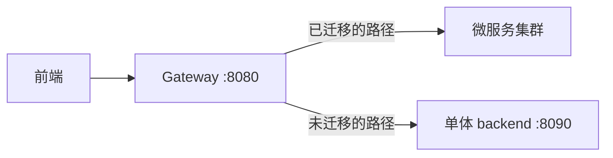

# OpenAtom 微服务 AI 搭建基础框架文档

> 版本：v1.0  
> 适用范围：指导 AI 编程助手从零搭建微服务基础框架  
> 配套文档：《OpenAtom 微服务重构开发文档》  
> 编写日期：2026-07

---

## 一、文档概述

### 1.1 文档定位

本文档是 **AI 编程助手可直接执行的操作手册**，提供逐步搭建微服务基础框架的指令、模板和验收标准。AI 助手按本文档顺序执行，即可生成一个可运行的微服务骨架工程。

### 1.2 前提条件

| 条件 | 要求 |
|------|------|
| JDK | 21+ |
| Maven | 3.9+ |
| Docker + Docker Compose | 已安装 |
| 技术栈 | Spring Boot 3.3.12 + Spring Cloud 2023.0.x + Nacos 2.3.x |
| 工作目录 | `openatom-system/services/`（新建子目录） |

### 1.3 工程根目录

所有微服务代码放在 `openatom-system/services/` 目录下：

```
openatom-system/
├── services/                    ← 新建：微服务工程根目录
│   ├── pom.xml                  ← 父 POM
│   ├── openatom-common/         ← 公共模块
│   ├── gateway-service/         ← 网关
│   ├── auth-service/            ← 认证授权
│   ├── user-service/            ← 用户
│   ├── club-service/            ← 社团组织
│   ├── recruitment-service/     ← 招新
│   ├── activity-service/        ← 活动报名
│   ├── blog-service/            ← 博客内容
│   ├── checkin-service/         ← 签到
│   ├── point-service/           ← 积分
│   ├── notification-service/    ← 通知
│   ├── office-service/          ← 办公文书
│   └── file-service/            ← 文件存储
├── docker-compose.microservices.yml  ← 微服务基础设施编排
└── backend/                     ← 原单体（迁移期保留）
```

---

## 二、搭建工作流总览

AI 助手按以下顺序执行，共 7 个阶段：

| 阶段 | 内容 | 产出 |
|------|------|------|
| 阶段 1 | 父 POM + 公共模块 | `services/pom.xml` + `openatom-common/` |
| 阶段 2 | 基础设施 Docker Compose | Nacos / RabbitMQ / MySQL / Redis |
| 阶段 3 | 网关服务 | `gateway-service/` |
| 阶段 4 | 第一个业务服务（auth-service） | `auth-service/` |
| 阶段 5 | 批量生成其余服务骨架 | 其余 10 个服务 |
| 阶段 6 | Nacos 配置文件 | 各服务配置 |
| 阶段 7 | 验证启动 | 全链路启动验证 |

---

## 三、阶段 1：父 POM + 公共模块

### 3.1 创建父 POM

**指令：** 在 `services/` 下创建 `pom.xml`

```xml
<?xml version="1.0" encoding="UTF-8"?>
<project xmlns="http://maven.apache.org/POM/4.0.0"
         xmlns:xsi="http://www.w3.org/2001/XMLSchema-instance"
         xsi:schemaLocation="http://maven.apache.org/POM/4.0.0 https://maven.apache.org/xsd/maven-4.0.0.xsd">
    <modelVersion>4.0.0</modelVersion>

    <parent>
        <groupId>org.springframework.boot</groupId>
        <artifactId>spring-boot-starter-parent</artifactId>
        <version>3.3.12</version>
        <relativePath/>
    </parent>

    <groupId>edu.jmi.openatom</groupId>
    <artifactId>openatom-cloud</artifactId>
    <version>1.0.0-SNAPSHOT</version>
    <packaging>pom</packaging>
    <name>openatom-cloud</name>
    <description>OpenAtom 微服务父工程</description>

    <modules>
        <module>openatom-common</module>
        <module>gateway-service</module>
        <module>auth-service</module>
        <module>user-service</module>
        <module>club-service</module>
        <module>recruitment-service</module>
        <module>activity-service</module>
        <module>blog-service</module>
        <module>checkin-service</module>
        <module>point-service</module>
        <module>notification-service</module>
        <module>office-service</module>
        <module>file-service</module>
    </modules>

    <properties>
        <java.version>21</java.version>
        <spring-cloud.version>2023.0.4</spring-cloud.version>
        <spring-cloud-alibaba.version>2023.0.1.2</spring-cloud-alibaba.version>
        <sa-token.version>1.37.0</sa-token.version>
        <mybatis-plus.version>3.5.5</mybatis-plus.version>
        <lombok.version>1.18.34</lombok.version>
        <poi.version>5.3.0</poi.version>
    </properties>

    <dependencyManagement>
        <dependencies>
            <!-- Spring Cloud -->
            <dependency>
                <groupId>org.springframework.cloud</groupId>
                <artifactId>spring-cloud-dependencies</artifactId>
                <version>${spring-cloud.version}</version>
                <type>pom</type>
                <scope>import</scope>
            </dependency>
            <!-- Spring Cloud Alibaba (Nacos + Sentinel) -->
            <dependency>
                <groupId>com.alibaba.cloud</groupId>
                <artifactId>spring-cloud-alibaba-dependencies</artifactId>
                <version>${spring-cloud-alibaba.version}</version>
                <type>pom</type>
                <scope>import</scope>
            </dependency>
            <!-- 公共模块 -->
            <dependency>
                <groupId>edu.jmi.openatom</groupId>
                <artifactId>openatom-common</artifactId>
                <version>${project.version}</version>
            </dependency>
            <!-- Sa-Token -->
            <dependency>
                <groupId>cn.dev33</groupId>
                <artifactId>sa-token-spring-boot3-starter</artifactId>
                <version>${sa-token.version}</version>
            </dependency>
            <!-- MyBatis-Plus -->
            <dependency>
                <groupId>com.baomidou</groupId>
                <artifactId>mybatis-plus-spring-boot3-starter</artifactId>
                <version>${mybatis-plus.version}</version>
            </dependency>
        </dependencies>
    </dependencyManagement>

    <build>
        <plugins>
            <plugin>
                <groupId>org.springframework.boot</groupId>
                <artifactId>spring-boot-maven-plugin</artifactId>
            </plugin>
        </plugins>
    </build>
</project>
```

### 3.2 创建公共模块 openatom-common

**目录结构：**
```
openatom-common/
├── pom.xml
└── src/main/java/edu/jmi/openatom/common/
    ├── result/Result.java
    ├── result/PageDataVO.java
    ├── exception/BusinessException.java
    ├── exception/GlobalExceptionHandler.java
    ├── exception/ResultCode.java
    ├── constant/CommonConstants.java
    ├── feign/FeignAuthInterceptor.java
    ├── security/UserContext.java
    └── mybatis/MyBatisPlusConfig.java
```

**pom.xml：**
```xml
<?xml version="1.0" encoding="UTF-8"?>
<project xmlns="http://maven.apache.org/POM/4.0.0"
         xmlns:xsi="http://www.w3.org/2001/XMLSchema-instance"
         xsi:schemaLocation="http://maven.apache.org/POM/4.0.0 https://maven.apache.org/xsd/maven-4.0.0.xsd">
    <modelVersion>4.0.0</modelVersion>
    <parent>
        <groupId>edu.jmi.openatom</groupId>
        <artifactId>openatom-cloud</artifactId>
        <version>1.0.0-SNAPSHOT</version>
    </parent>
    <artifactId>openatom-common</artifactId>
    <description>公共模块：统一响应、异常、Feign、安全上下文</description>

    <dependencies>
        <dependency>
            <groupId>org.springframework.boot</groupId>
            <artifactId>spring-boot-starter-web</artifactId>
        </dependency>
        <dependency>
            <groupId>org.springframework.boot</groupId>
            <artifactId>spring-boot-starter-validation</artifactId>
        </dependency>
        <dependency>
            <groupId>cn.dev33</groupId>
            <artifactId>sa-token-spring-boot3-starter</artifactId>
        </dependency>
        <dependency>
            <groupId>com.baomidou</groupId>
            <artifactId>mybatis-plus-spring-boot3-starter</artifactId>
        </dependency>
        <dependency>
            <groupId>org.projectlombok</groupId>
            <artifactId>lombok</artifactId>
            <optional>true</optional>
        </dependency>
    </dependencies>
</project>
```

**核心类模板：**

`Result.java` — 统一响应体（与现有单体保持一致）：
```java
package edu.jmi.openatom.common.result;

import lombok.Data;

@Data
public class Result<T> {
    private int code;
    private String message;
    private T data;

    public static <T> Result<T> success(T data) {
        Result<T> r = new Result<>();
        r.code = 200; r.message = "success"; r.data = data;
        return r;
    }
    public static <T> Result<T> error(int code, String message) {
        Result<T> r = new Result<>();
        r.code = code; r.message = message;
        return r;
    }
}
```

`BusinessException.java`：
```java
package edu.jmi.openatom.common.exception;

public class BusinessException extends RuntimeException {
    private final int code;
    public BusinessException(int code, String message) {
        super(message);
        this.code = code;
    }
    public int getCode() { return code; }
}
```

`GlobalExceptionHandler.java`：
```java
package edu.jmi.openatom.common.exception;

import edu.jmi.openatom.common.result.Result;
import org.springframework.web.bind.annotation.ExceptionHandler;
import org.springframework.web.bind.annotation.RestControllerAdvice;

@RestControllerAdvice
public class GlobalExceptionHandler {
    @ExceptionHandler(BusinessException.class)
    public Result<Void> handleBusiness(BusinessException e) {
        return Result.error(e.getCode(), e.getMessage());
    }
    @ExceptionHandler(Exception.class)
    public Result<Void> handleAll(Exception e) {
        return Result.error(500, e.getMessage());
    }
}
```

`FeignAuthInterceptor.java` — Feign 请求传递登录态：
```java
package edu.jmi.openatom.common.feign;

import feign.RequestInterceptor;
import feign.RequestTemplate;
import org.springframework.stereotype.Component;
import org.springframework.web.context.request.RequestContextHolder;
import org.springframework.web.context.request.ServletRequestAttributes;
import jakarta.servlet.http.HttpServletRequest;

@Component
public class FeignAuthInterceptor implements RequestInterceptor {
    @Override
    public void apply(RequestTemplate template) {
        var attrs = (ServletRequestAttributes) RequestContextHolder.getRequestAttributes();
        if (attrs != null) {
            HttpServletRequest request = attrs.getRequest();
            String token = request.getHeader("Authorization");
            if (token != null) {
                template.header("Authorization", token);
            }
        }
    }
}
```

`UserContext.java` — 用户上下文工具：
```java
package edu.jmi.openatom.common.security;

import cn.dev33.satoken.stp.StpUtil;

public class UserContext {
    public static Long getCurrentUserId() {
        return StpUtil.getLoginIdAsLong();
    }
    public static boolean isLoggedIn() {
        return StpUtil.isLogin();
    }
}
```

### 3.3 验收

```bash
cd services
mvn clean install -pl openatom-common
# 期望：BUILD SUCCESS
```

---

## 四、阶段 2：基础设施 Docker Compose

**指令：** 在 `openatom-system/` 根目录创建 `docker-compose.microservices.yml`

```yaml
version: "3.8"

services:
  mysql:
    image: mysql:8.0
    container_name: openatom-ms-mysql
    environment:
      MYSQL_ROOT_PASSWORD: ${MYSQL_PASSWORD:-openatom123}
      TZ: Asia/Shanghai
    ports:
      - "3306:3306"
    volumes:
      - ms-mysql-data:/var/lib/mysql
    networks:
      - openatom-ms
    restart: unless-stopped

  redis:
    image: redis:7-alpine
    container_name: openatom-ms-redis
    command: redis-server --requirepass ${REDIS_PASSWORD:-openatom123}
    ports:
      - "6379:6379"
    volumes:
      - ms-redis-data:/data
    networks:
      - openatom-ms
    restart: unless-stopped

  nacos:
    image: nacos/nacos-server:v2.3.2
    container_name: openatom-ms-nacos
    environment:
      MODE: standalone
      JVM_XMS: 256m
      JVM_XMX: 512m
    ports:
      - "8848:8848"
      - "9848:9848"
    networks:
      - openatom-ms
    restart: unless-stopped

  rabbitmq:
    image: rabbitmq:3.13-management
    container_name: openatom-ms-rabbitmq
    environment:
      RABBITMQ_DEFAULT_USER: ${RABBITMQ_USER:-openatom}
      RABBITMQ_DEFAULT_PASS: ${RABBITMQ_PASSWORD:-openatom123}
    ports:
      - "5672:5672"
      - "15672:15672"
    volumes:
      - ms-rabbitmq-data:/var/lib/rabbitmq
    networks:
      - openatom-ms
    restart: unless-stopped

volumes:
  ms-mysql-data:
  ms-redis-data:
  ms-rabbitmq-data:

networks:
  openatom-ms:
    driver: bridge
```

**启动指令：**
```bash
docker compose -f docker-compose.microservices.yml up -d
```

**验收：**
- Nacos 控制台：http://localhost:8848/nacos （账号 nacos / nacos）
- RabbitMQ 控制台：http://localhost:15672
- MySQL 可连接、Redis 可连接

---

## 五、阶段 3：网关服务

### 5.1 创建 gateway-service

**pom.xml：**
```xml
<?xml version="1.0" encoding="UTF-8"?>
<project xmlns="http://maven.apache.org/POM/4.0.0"
         xmlns:xsi="http://www.w3.org/2001/XMLSchema-instance"
         xsi:schemaLocation="http://maven.apache.org/POM/4.0.0 https://maven.apache.org/xsd/maven-4.0.0.xsd">
    <modelVersion>4.0.0</modelVersion>
    <parent>
        <groupId>edu.jmi.openatom</groupId>
        <artifactId>openatom-cloud</artifactId>
        <version>1.0.0-SNAPSHOT</version>
    </parent>
    <artifactId>gateway-service</artifactId>

    <dependencies>
        <dependency>
            <groupId>org.springframework.cloud</groupId>
            <artifactId>spring-cloud-starter-gateway</artifactId>
        </dependency>
        <dependency>
            <groupId>com.alibaba.cloud</groupId>
            <artifactId>spring-cloud-starter-alibaba-nacos-discovery</artifactId>
        </dependency>
        <dependency>
            <groupId>cn.dev33</groupId>
            <artifactId>sa-token-spring-boot3-starter</artifactId>
        </dependency>
        <dependency>
            <groupId>cn.dev33</groupId>
            <artifactId>sa-token-reactor-spring-boot3-starter</artifactId>
            <version>${sa-token.version}</version>
        </dependency>
        <dependency>
            <groupId>cn.dev33</groupId>
            <artifactId>sa-token-redis-jackson</artifactId>
            <version>${sa-token.version}</version>
        </dependency>
        <dependency>
            <groupId>org.apache.commons</groupId>
            <artifactId>commons-pool2</artifactId>
        </dependency>
    </dependencies>
</project>
```

**启动类 `GatewayApplication.java`：**
```java
package edu.jmi.openatom.gateway;

import org.springframework.boot.SpringApplication;
import org.springframework.boot.autoconfigure.SpringBootApplication;
import org.springframework.cloud.client.discovery.EnableDiscoveryClient;

@SpringBootApplication
@EnableDiscoveryClient
public class GatewayApplication {
    public static void main(String[] args) {
        SpringApplication.run(GatewayApplication.class, args);
    }
}
```

**`application.yml`：**
```yaml
server:
  port: 8080

spring:
  application:
    name: gateway-service
  cloud:
    nacos:
      discovery:
        server-addr: ${NACOS_ADDR:127.0.0.1:8848}
    gateway:
      routes:
        - id: auth-service
          uri: lb://auth-service
          predicates:
            - Path=/api/auth/**
        - id: user-service
          uri: lb://user-service
          predicates:
            - Path=/api/users/**
        - id: club-service
          uri: lb://club-service
          predicates:
            - Path=/api/clubs/**,/api/memberships/**,/api/awards/**
        - id: recruitment-service
          uri: lb://recruitment-service
          predicates:
            - Path=/api/applications/**,/api/recruitment-campaigns/**,/api/site-forms/**,/api/interviews/**
        - id: activity-service
          uri: lb://activity-service
          predicates:
            - Path=/api/activities/**,/api/site/**
        - id: blog-service
          uri: lb://blog-service
          predicates:
            - Path=/api/blog/**
        - id: checkin-service
          uri: lb://checkin-service
          predicates:
            - Path=/api/checkin/**
        - id: point-service
          uri: lb://point-service
          predicates:
            - Path=/api/points/**
        - id: notification-service
          uri: lb://notification-service
          predicates:
            - Path=/api/notifications/**
        - id: office-service
          uri: lb://office-service
          predicates:
            - Path=/api/office-documents/**
        - id: file-service
          uri: lb://file-service
          predicates:
            - Path=/api/files/**

sa-token:
  token-name: Authorization
  timeout: 86400
  is-concurrent: true
  is-share: true
  token-style: uuid
  is-log: false

# Redis（Sa-Token 共享会话）
spring.data.redis:
  host: ${REDIS_HOST:127.0.0.1}
  port: ${REDIS_PORT:6379}
  password: ${REDIS_PASSWORD:openatom123}
```

**网关鉴权过滤器 `SaTokenGatewayFilter.java`：**
```java
package edu.jmi.openatom.gateway.filter;

import cn.dev33.satoken.stp.StpUtil;
import org.springframework.cloud.gateway.filter.GatewayFilterChain;
import org.springframework.cloud.gateway.filter.GlobalFilter;
import org.springframework.core.annotation.Order;
import org.springframework.http.HttpStatus;
import org.springframework.stereotype.Component;
import org.springframework.web.server.ServerWebExchange;
import reactor.core.publisher.Mono;
import java.util.List;

@Component
@Order(-100)
public class SaTokenGatewayFilter implements GlobalFilter {

    // 白名单路径
    private static final List<String> WHITELIST = List.of(
            "/api/auth/login",
            "/api/auth/register",
            "/api/site/",
            "/api/blog/articles/",
            "/api/health"
    );

    @Override
    public Mono<Void> filter(ServerWebExchange exchange, GatewayFilterChain chain) {
        String path = exchange.getRequest().getURI().getPath();
        // 白名单放行
        if (WHITELIST.stream().anyMatch(path::startsWith)) {
            return chain.filter(exchange);
        }
        // Sa-Token 校验
        if (!StpUtil.isLogin()) {
            exchange.getResponse().setStatusCode(HttpStatus.UNAUTHORIZED);
            return exchange.getResponse().setComplete();
        }
        return chain.filter(exchange);
    }
}
```

### 5.2 验收

```bash
cd services
mvn clean package -pl gateway-service -am
java -jar gateway-service/target/gateway-service-1.0.0-SNAPSHOT.jar
# 期望：启动成功，注册到 Nacos
# 访问 http://localhost:8080/api/health → 路由到对应服务
```

---

## 六、阶段 4：第一个业务服务（auth-service 模板）

本节以 auth-service 为**完整模板**，其余服务按相同模式生成。

### 6.1 目录结构

```
auth-service/
├── pom.xml
└── src/main/
    ├── java/edu/jmi/openatom/auth/
    │   ├── AuthApplication.java
    │   ├── controller/AuthController.java
    │   ├── service/AuthService.java
    │   ├── service/impl/AuthServiceImpl.java
    │   ├── mapper/RoleMapper.java
    │   ├── entity/SysRole.java
    │   ├── dto/LoginDTO.java
    │   ├── vo/LoginVO.java
    │   └── config/SaPermissionConfig.java
    └── resources/
        ├── application.yml
        ├── application-dev.yml
        └── db/migration/
            ├── V1__create_auth_tables.sql
            └── V2__init_permissions.sql
```

### 6.2 pom.xml（业务服务标准模板）

```xml
<?xml version="1.0" encoding="UTF-8"?>
<project xmlns="http://maven.apache.org/POM/4.0.0"
         xmlns:xsi="http://www.w3.org/2001/XMLSchema-instance"
         xsi:schemaLocation="http://maven.apache.org/POM/4.0.0 https://maven.apache.org/xsd/maven-4.0.0.xsd">
    <modelVersion>4.0.0</modelVersion>
    <parent>
        <groupId>edu.jmi.openatom</groupId>
        <artifactId>openatom-cloud</artifactId>
        <version>1.0.0-SNAPSHOT</version>
    </parent>
    <artifactId>auth-service</artifactId>

    <dependencies>
        <!-- 公共模块 -->
        <dependency>
            <groupId>edu.jmi.openatom</groupId>
            <artifactId>openatom-common</artifactId>
        </dependency>
        <!-- Nacos 服务发现 -->
        <dependency>
            <groupId>com.alibaba.cloud</groupId>
            <artifactId>spring-cloud-starter-alibaba-nacos-discovery</artifactId>
        </dependency>
        <!-- OpenFeign -->
        <dependency>
            <groupId>org.springframework.cloud</groupId>
            <artifactId>spring-cloud-starter-openfeign</artifactId>
        </dependency>
        <!-- Sa-Token + Redis -->
        <dependency>
            <groupId>cn.dev33</groupId>
            <artifactId>sa-token-redis-jackson</artifactId>
            <version>${sa-token.version}</version>
        </dependency>
        <dependency>
            <groupId>org.apache.commons</groupId>
            <artifactId>commons-pool2</artifactId>
        </dependency>
        <!-- MySQL + MyBatis-Plus -->
        <dependency>
            <groupId>com.mysql</groupId>
            <artifactId>mysql-connector-j</artifactId>
        </dependency>
        <!-- Flyway -->
        <dependency>
            <groupId>org.flywaydb</groupId>
            <artifactId>flyway-core</artifactId>
        </dependency>
        <dependency>
            <groupId>org.flywaydb</groupId>
            <artifactId>flyway-mysql</artifactId>
        </dependency>
        <!-- Spring Security Crypto（密码加密） -->
        <dependency>
            <groupId>org.springframework.security</groupId>
            <artifactId>spring-security-crypto</artifactId>
        </dependency>
    </dependencies>
</project>
```

### 6.3 启动类

```java
package edu.jmi.openatom.auth;

import org.mybatis.spring.annotation.MapperScan;
import org.springframework.boot.SpringApplication;
import org.springframework.boot.autoconfigure.SpringBootApplication;
import org.springframework.cloud.client.discovery.EnableDiscoveryClient;
import org.springframework.cloud.openfeign.EnableFeignClients;

@SpringBootApplication
@EnableDiscoveryClient
@EnableFeignClients
@MapperScan("edu.jmi.openatom.auth.mapper")
public class AuthApplication {
    public static void main(String[] args) {
        SpringApplication.run(AuthApplication.class, args);
    }
}
```

### 6.4 application.yml（业务服务标准模板）

```yaml
server:
  port: 8101

spring:
  application:
    name: auth-service
  profiles:
    active: ${SPRING_PROFILES_ACTIVE:dev}
  datasource:
    url: ${AUTH_DB_URL:jdbc:mysql://127.0.0.1:3306/db_auth?createDatabaseIfNotExist=true&useUnicode=true&characterEncoding=utf8&serverTimezone=Asia/Shanghai&allowPublicKeyRetrieval=true&useSSL=false}
    username: ${AUTH_DB_USERNAME:root}
    password: ${AUTH_DB_PASSWORD:openatom123}
    driver-class-name: com.mysql.cj.jdbc.Driver
  flyway:
    enabled: true
    locations: classpath:db/migration
    baseline-on-migrate: true
  cloud:
    nacos:
      discovery:
        server-addr: ${NACOS_ADDR:127.0.0.1:8848}

# Sa-Token
sa-token:
  token-name: Authorization
  timeout: 86400
  is-concurrent: true
  is-share: true
  token-style: uuid
  is-log: false

# Redis
  data:
    redis:
      host: ${REDIS_HOST:127.0.0.1}
      port: ${REDIS_PORT:6379}
      password: ${REDIS_PASSWORD:openatom123}

# MyBatis-Plus
mybatis-plus:
  configuration:
    map-underscore-to-camel-case: true
```

### 6.5 Flyway 迁移脚本模板

`V1__create_auth_tables.sql`（从原 `create_table.sql` 提取 auth 相关表）：
```sql
CREATE TABLE IF NOT EXISTS `sys_role` (
    `id` INT NOT NULL AUTO_INCREMENT,
    `name` VARCHAR(50) NOT NULL,
    `code` VARCHAR(50) NOT NULL,
    `data_scope` VARCHAR(255) DEFAULT NULL,
    `description` VARCHAR(255) DEFAULT NULL,
    PRIMARY KEY (`id`),
    UNIQUE KEY `uk_role_code` (`code`)
) ENGINE=InnoDB DEFAULT CHARSET=utf8mb4;

-- ... 其余 auth 相关表按原 create_table.sql 提取
```

> **AI 指令：** 从 `backend/db/create_table.sql` 中提取 `sys_role`、`sys_permission`、`sys_role_permission`、`sys_user_role` 四张表的 DDL，放入 `V1`；提取权限种子数据 INSERT 语句放入 `V2`。

### 6.6 验收

```bash
cd services
mvn clean package -pl auth-service -am
java -jar auth-service/target/auth-service-1.0.0-SNAPSHOT.jar
# 期望：启动成功，注册到 Nacos，Flyway 自动建表
```

---

## 七、阶段 5：批量生成其余服务骨架

### 7.1 AI 生成指令模板

对每个服务，AI 助手执行以下步骤（以 user-service 为例）：

```
生成 user-service 骨架，参数如下：
- artifactId: user-service
- 包名: edu.jmi.openatom.user
- 端口: 8102
- 数据库名: db_user
- 数据库表: tb_user, login_log
- 环境变量前缀: USER_DB
- 对应原表 DDL 来源: backend/db/create_table.sql 中的 tb_user 和 login_log

请按 auth-service 模板生成以下文件：
1. pom.xml（复制 auth-service 模板，改 artifactId）
2. 启动类（改包名和类名）
3. application.yml（改端口、数据库名、环境变量前缀）
4. db/migration/V1__create_user_tables.sql（提取对应表 DDL）
5. 空的 controller/service/mapper/entity 目录占位
```

### 7.2 各服务生成参数速查表

| 服务 | artifactId | 包名 | 端口 | 数据库 | 表 | 环境变量前缀 |
|------|-----------|------|------|--------|-----|-------------|
| 用户 | user-service | edu.jmi.openatom.user | 8102 | db_user | tb_user, login_log | USER_DB |
| 社团 | club-service | edu.jmi.openatom.club | 8103 | db_club | club, club_department, club_position, club_position_role, club_membership, exit_application, club_award | CLUB_DB |
| 招新 | recruitment-service | edu.jmi.openatom.recruitment | 8104 | db_recruitment | recruitment_campaign, membership_application, approval_record, interview, interview_interviewer, interview_feedback, site_form, form_submission | RECRUITMENT_DB |
| 活动 | activity-service | edu.jmi.openatom.activity | 8105 | db_activity | club_activity, activity_registration | ACTIVITY_DB |
| 博客 | blog-service | edu.jmi.openatom.blog | 8106 | db_blog | blog_article, blog_comment, blog_article_interaction | BLOG_DB |
| 签到 | checkin-service | edu.jmi.openatom.checkin | 8107 | db_checkin | checkin_session, checkin_group, checkin_group_member, checkin_target, checkin_record | CHECKIN_DB |
| 积分 | point-service | edu.jmi.openatom.point | 8108 | db_point | point_account, point_transaction, point_redeem_item, point_redemption | POINT_DB |
| 通知 | notification-service | edu.jmi.openatom.notification | 8109 | db_notification | notification, notification_receiver | NOTIFICATION_DB |
| 文书 | office-service | edu.jmi.openatom.office | 8110 | db_office | office_document | OFFICE_DB |
| 文件 | file-service | edu.jmi.openatom.file | 8111 | db_file_storage | image_hosting_asset | FILE_DB |

### 7.3 标准 application.yml 变量替换

每个服务的 `application.yml` 只需替换以下变量：

```
{SERVICE_NAME}     → spring.application.name
{PORT}             → server.port
{PACKAGE}          → @MapperScan 路径
{DB_NAME}          → 数据库名
{DB_PREFIX}        → 环境变量前缀（如 USER_DB）
```

模板：
```yaml
server:
  port: {PORT}
spring:
  application:
    name: {SERVICE_NAME}
  datasource:
    url: ${{DB_PREFIX}_DB_URL:jdbc:mysql://127.0.0.1:3306/{DB_NAME}?createDatabaseIfNotExist=true&useUnicode=true&characterEncoding=utf8&serverTimezone=Asia/Shanghai&allowPublicKeyRetrieval=true&useSSL=false}
    username: ${{DB_PREFIX}_DB_USERNAME:root}
    password: ${{DB_PREFIX}_DB_PASSWORD:openatom123}
# ... 其余与 auth-service 一致
```

### 7.4 Flyway 脚本拆分指令

```
AI 指令：将 backend/db/create_table.sql 按以下规则拆分到各服务的 db/migration/V1__create_xxx_tables.sql：

- auth-service: sys_role, sys_permission, sys_role_permission, sys_user_role + 权限/角色种子 INSERT
- user-service: tb_user + admin 种子 INSERT
- club-service: club, club_department, club_position, club_position_role, club_membership, exit_application, club_award
- recruitment-service: recruitment_campaign, membership_application, approval_record, interview, interview_interviewer, interview_feedback, site_form, form_submission
- activity-service: club_activity, activity_registration
- blog-service: blog_article, blog_comment, blog_article_interaction
- checkin-service: checkin_session, checkin_group, checkin_group_member, checkin_target, checkin_record
- point-service: point_account, point_transaction, point_redeem_item, point_redemption + 积分配置种子
- notification-service: notification, notification_receiver
- office-service: office_document
- file-service: image_hosting_asset

注意：system_setting 和 operation_log 暂放入 user-service 的 V1 脚本。
```

---

## 八、阶段 6：Nacos 配置管理

### 8.1 Nacos 配置规划

将各服务的 `application.yml` 中的可变配置抽取到 Nacos 配置中心：

| Data ID | Group | 内容 |
|---------|-------|------|
| `auth-service-dev.yaml` | OPENATOM | auth-service 开发环境配置 |
| `auth-service-prod.yaml` | OPENATOM | auth-service 生产环境配置 |
| `shared-datasource.yaml` | OPENATOM | 共享数据源模板 |
| `shared-redis.yaml` | OPENATOM | 共享 Redis 配置 |
| `shared-satoken.yaml` | OPENATOM | 共享 Sa-Token 配置 |

### 8.2 共享配置示例

`shared-satoken.yaml`（Nacos 中的共享配置）：
```yaml
sa-token:
  token-name: Authorization
  timeout: 86400
  is-concurrent: true
  is-share: true
  token-style: uuid
  is-log: false
```

### 8.3 服务端引入 Nacos 配置

在各服务 `application.yml` 中添加：
```yaml
spring:
  cloud:
    nacos:
      config:
        server-addr: ${NACOS_ADDR:127.0.0.1:8848}
        file-extension: yaml
        shared-configs:
          - data-id: shared-redis.yaml
            group: OPENATOM
            refresh: true
          - data-id: shared-satoken.yaml
            group: OPENATOM
            refresh: true
```

---

## 九、阶段 7：全链路启动验证

### 9.1 启动顺序

```bash
# 1. 基础设施
docker compose -f docker-compose.microservices.yml up -d

# 2. 网关
cd services && mvn clean package -pl gateway-service -am
java -jar gateway-service/target/gateway-service-1.0.0-SNAPSHOT.jar &

# 3. auth-service
mvn clean package -pl auth-service -am
java -jar auth-service/target/auth-service-1.0.0-SNAPSHOT.jar &

# 4. 其余服务（可并行）
for svc in user-service club-service recruitment-service activity-service \
           blog-service checkin-service point-service notification-service \
           office-service file-service; do
    mvn clean package -pl $svc -am -DskipTests
    java -jar $svc/target/$svc-1.0.0-SNAPSHOT.jar &
done
```

### 9.2 验收清单

| 序号 | 验证项 | 方法 | 期望结果 |
|------|--------|------|----------|
| 1 | Nacos 服务列表 | 访问 http://localhost:8848/nacos | 12 个服务全部在线 |
| 2 | 网关路由 | `GET http://localhost:8080/api/auth/health` | 200 OK |
| 3 | 登录接口 | `POST http://localhost:8080/api/auth/login` | 返回 Token |
| 4 | 鉴权拦截 | 不带 Token 访问 `/api/users` | 401 Unauthorized |
| 5 | 带 Token 访问 | 带 Token 访问 `/api/users` | 200 OK |
| 6 | Flyway 建表 | 检查 MySQL 各库 | 每个库有对应表 |
| 7 | Redis 会话 | 登录后检查 Redis | 有 Sa-Token 会话记录 |
| 8 | Feign 调用 | club-service 调用 user-service | 正常返回数据 |

---

## 十、Dockerfile 模板

每个微服务统一 Dockerfile：

```dockerfile
FROM maven:3.9.9-eclipse-temurin-21 AS build
WORKDIR /workspace
COPY services/ ./services/
RUN mvn -B -q -f services/pom.xml -pl {SERVICE_NAME} -am -DskipTests package

FROM eclipse-temurin:21-jre-jammy
ENV SPRING_PROFILES_ACTIVE=prod \
    TZ=Asia/Shanghai \
    JAVA_OPTS=""
WORKDIR /app
COPY --from=build /workspace/services/{SERVICE_NAME}/target/{SERVICE_NAME}-*.jar /app/app.jar
EXPOSE {PORT}
ENTRYPOINT ["sh", "-c", "java $JAVA_OPTS -jar /app/app.jar"]
```

> `{SERVICE_NAME}` 和 `{PORT}` 按各服务替换。

---

## 十一、迁移期双运行方案

迁移期间，单体（backend）与微服务并存，网关统一路由：



**网关路由策略（迁移期）：**
```yaml
spring.cloud.gateway.routes:
  # 已迁移服务
  - id: auth-service
    uri: lb://auth-service
    predicates: [Path=/api/auth/**]
  # 未迁移的路径 → 转发到单体
  - id: legacy-monolith
    uri: http://openatom-backend:8090
    predicates: [Path=/api/**]
```

> 路由按顺序匹配，已迁移的路径优先匹配到微服务，其余 fallback 到单体。

---

## 十二、AI 搭建速查指令汇总

以下指令可直接发给 AI 编程助手按序执行：

```
1. 创建 services/ 目录，生成父 pom.xml（见阶段1）
2. 生成 openatom-common 公共模块（见阶段1）
3. 生成 docker-compose.microservices.yml（见阶段2）
4. 生成 gateway-service（见阶段3）
5. 生成 auth-service 完整模板（见阶段4）
6. 按 7.2 速查表批量生成其余 10 个服务骨架
7. 按 7.4 指令拆分 Flyway 脚本到各服务
8. 生成各服务 Dockerfile（见第十章）
9. 按 9.1 顺序启动并验证
```

---

> 本文档为 AI 搭建操作手册，架构设计细节请参考配套文档《OpenAtom 微服务重构开发文档》。
