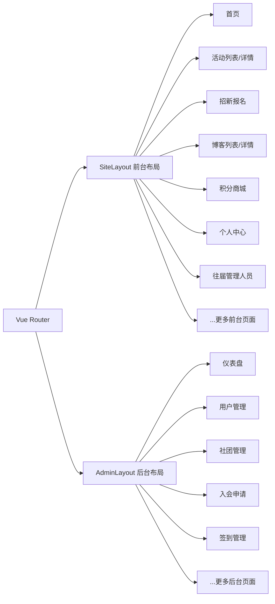
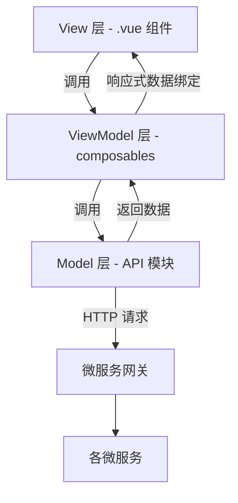

# OpenAtom 前端 UI 架构与微服务适配开发文档

> 版本：v1.0  
> 适用范围：web_pc 前端适配微服务架构 + UI 设计规范  
> 配套文档：《微服务重构开发文档》《AI 搭建基础框架文档》  
> 编写日期：2026-07

---

## 一、文档概述

### 1.1 文档目的

本文档覆盖前端两个维度：

1. **微服务适配**：前端 API 层如何从单体调用平滑过渡到微服务网关调用
2. **UI 设计规范**：统一设计系统、组件规范、页面布局标准

面向开发人员和 AI 编程助手，提供架构设计、迁移方案、代码模板和规范约定。

### 1.2 前端工程范围

| 端 | 路径 | 技术栈 | 状态 |
|----|------|--------|------|
| Web PC 管理端 + 前台 | `frontend/web_pc/` | Vue 3 + Vite + Element Plus + Tailwind | 本文档重点 |
| UniApp 小程序 | `frontend/uni_app/` | uni-app | 参考适配 |
| iOS App | `frontend/ios_app/` | 原生 | 参考适配 |

---

## 二、前端架构现状

### 2.1 技术栈

| 层面 | 技术 | 版本 |
|------|------|------|
| 框架 | Vue | 3.5 |
| 构建工具 | Vite | 6.0 |
| 语言 | TypeScript | 5.8 |
| UI 组件库 | Element Plus | 2.9 |
| CSS 框架 | Tailwind CSS | 3.4 |
| 路由 | Vue Router | 4.5 |
| HTTP | Axios | 1.7 |
| 动画 | GSAP / Motion-V | 3.15 / 2.2 |
| Markdown | markdown-it | 14.2 |
| 地图 | Mapbox GL | 3.23 |
| 图表 | Mermaid | 10.9 |
| 格式化 | oxfmt | 0.48 |
| 包管理 | pnpm | 9.0 |

### 2.2 目录结构

```
frontend/web_pc/src/
├── api/
│   ├── request.ts           ← Axios 实例 + 拦截器
│   └── index.ts             ← 全部 API 定义（1053 行，20+ 模块）
├── router/
│   └── index.ts             ← 路由配置（双布局嵌套）
├── layouts/
│   ├── AdminLayout.vue       ← 后台管理布局
│   └── SiteLayout.vue        ← 前台站点布局
├── views/
│   ├── admin/                ← 后台管理页面（25+ 个 .vue）
│   ├── site/                 ← 前台站点页面（25+ 个 .vue）
│   └── AuthCallback.vue      ← OAuth 回调
├── components/
│   ├── admin/                ← 后台业务组件
│   ├── common/               ← 通用组件
│   └── site/                 ← 前台业务组件（home/, blog/, shell/）
├── composables/                ← ViewModel 层（MVVM 核心）
│   ├── useAppStatus.ts       ← 全局请求 loading、导航状态
│   ├── useAuth.ts            ← 认证会话（全局共享）
│   ├── useNotification.ts    ← 通知未读数（全局共享）
│   ├── usePagination.ts      ← 通用分页逻辑（复用）
│   └── use{PageName}.ts      ← 各页面级 ViewModel
├── types/                      ← TypeScript 类型定义（DTO/VO/Entity）
│   ├── user.ts
│   ├── club.ts
│   └── common.ts
├── utils/
│   ├── auth.ts               ← 会话/Token 管理
│   ├── permission.ts         ← 权限校验
│   ├── oidc.ts               ← OAuth/OIDC URL 构建
│   ├── format.ts             ← 格式化工具
│   ├── markdown.ts           ← Markdown 渲染
│   └── qr.ts                 ← 二维码工具
├── App.vue
└── main.ts
```

### 2.3 路由架构

采用 **双布局嵌套路由**：



**路由守卫机制：**
- `requiresAdminAuth`：`/admin/*` 路径需登录 + 管理员权限
- `requiresSiteLogin`：前台需登录页面（meta 标记）
- `meta.permissions`：路由级权限码校验（如 `['user:list']`）
- 无权限时自动跳转到 `firstAccessibleAdminPath()`
- Token 失效时重定向到 OAuth 授权 URL
- 路由懒加载 + 网络故障自动重试（`resilientView`）

### 2.4 API 请求层现状

**Axios 实例配置（`api/request.ts`）：**
- baseURL：`VITE_API_BASE_URL || '/api/v1'`
- 请求拦截器：注入 `jmiopenatom`（Token 原始值）+ `Authorization: Bearer {token}` 双头
- 响应拦截器：解包统一响应体 `{ code, message, data }`，code 非 0 抛错
- 401 自动清除会话并重定向登录
- GET 请求自动重试（网络错误 / 5xx，最多 1 次）
- `silent` 选项：静默请求不弹错误提示
- 流式请求（SSE）：`postAiStream` 函数，支持 AI 对话流式响应

**API 模块与微服务映射（`api/index.ts`）：**

| 前端 API 模块 | 对应微服务 | 说明 |
|--------------|-----------|------|
| authApi | auth-service | 登录/注册/Token/OAuth |
| oauthClientApi | auth-service | OAuth 客户端管理 |
| userApi | user-service | 用户 CRUD/导入/头像 |
| clubApi | club-service | 社团/部门/岗位 |
| positionApi | club-service | 岗位管理 |
| campaignApi | recruitment-service | 招新计划 |
| siteFormApi | recruitment-service | 信息表单 |
| formSubmissionApi | recruitment-service | 表单提交 |
| applicationApi | recruitment-service | 入会申请 |
| approvalApi | recruitment-service | 审批 |
| interviewApi | recruitment-service | 面试 |
| membershipApi | club-service | 成员管理 |
| alumniGroupApi | club-service | 往届分组 |
| activityApi | activity-service | 活动管理 |
| blogApi | blog-service | 博客 |
| checkInApi | checkin-service | 签到 |
| pointApi | point-service | 积分 |
| notificationApi | notification-service | 通知 |
| officeDocumentApi | office-service | 办公文书 |
| imageHostingApi | file-service | 图床 |
| rbacApi | auth-service | 角色/权限 |
| logApi | user-service | 日志 |
| siteApi | activity-service（聚合） | 前台公开接口 |
| botManagementApi | bot-service（可选） | QQ 机器人 |
| aiActivityApi | ai-service（可选） | AI 活动自动化 |

### 2.5 认证机制

```
用户登录 → authApi.login() → 后端 Sa-Token 写 Redis → 返回 Token
→ 前端存 localStorage（token/user/roles/permissions）
→ 后续请求双头携带：jmiopenatom + Authorization: Bearer
→ 401 时清除会话 → 重定向 OAuth 授权 URL
```

Token 存储 key：`openatom_token`、`openatom_user`、`openatom_roles`、`openatom_permissions`

---

## 三、微服务适配方案

### 3.1 核心原则：网关兼容，前端无感

微服务重构后，前端 **API 路径不变**，由网关层负责路由到各微服务：

```
前端请求:  GET /api/v1/users
           ↓
网关路由:  /api/v1/users → user-service
           ↓
微服务:    user-service 处理并返回
```

**适配策略：仅改 baseURL，不改 API 路径。**

### 3.2 API 层重构：从集中式到分模块

当前 `api/index.ts` 单文件 1053 行，重构为 **按微服务分模块**：

```
src/api/
├── request.ts              ← Axios 实例（保留，不拆）
├── index.ts                ← 统一导出（re-export）
├── modules/
│   ├── auth.ts             ← authApi, oauthClientApi, rbacApi
│   ├── user.ts             ← userApi, logApi
│   ├── club.ts             ← clubApi, positionApi, membershipApi, alumniGroupApi, awardApi
│   ├── recruitment.ts      ← campaignApi, siteFormApi, formSubmissionApi, applicationApi, approvalApi, interviewApi
│   ├── activity.ts         ← activityApi, siteApi（前台聚合）
│   ├── blog.ts             ← blogApi
│   ├── checkin.ts          ← checkInApi
│   ├── point.ts            ← pointApi
│   ├── notification.ts     ← notificationApi
│   ├── office.ts           ← officeDocumentApi
│   ├── file.ts             ← imageHostingApi
│   └── optional/
│       ├── bot.ts          ← botManagementApi
│       └── ai.ts           ← aiActivityApi, aiSettingsApi
```

**`api/index.ts` 改为统一 re-export：**
```typescript
// 重构后：统一导出，业务代码 import 路径不变
export * from './modules/auth'
export * from './modules/user'
export * from './modules/club'
export * from './modules/recruitment'
export * from './modules/activity'
export * from './modules/blog'
export * from './modules/checkin'
export * from './modules/point'
export * from './modules/notification'
export * from './modules/office'
export * from './modules/file'
export * from './modules/optional/bot'
export * from './modules/optional/ai'
```

> **关键：** 业务代码 `import { userApi } from '@/api'` 路径不变，实现平滑迁移。

### 3.3 request.ts 适配微服务

**无需大改**，仅确认以下点：

```typescript
// 现有配置已兼容微服务，无需修改
const service: AxiosInstance = axios.create({
  baseURL: import.meta.env.VITE_API_BASE_URL || '/api/v1',  // ← 网关地址
  timeout: 20000,
  withCredentials: true,
})

// 请求头：双头兼容 Sa-Token（网关校验 jmiopenatom 或 Authorization）
config.headers.jmiopenatom = token
config.headers.Authorization = `Bearer ${token}`
```

**迁移期双 baseURL 方案（可选）：**

如果迁移期前端需要同时访问单体和微服务，可创建第二个 axios 实例：

```typescript
// api/request-legacy.ts — 迁移期访问单体
const legacyService = axios.create({
  baseURL: import.meta.env.VITE_LEGACY_API_BASE_URL || '/api/v1',
  timeout: 20000,
  withCredentials: true,
})
// 复用相同拦截器逻辑...
```

### 3.4 环境变量适配

```env
# .env (现有)
VITE_API_BASE_URL=/api/v1

# .env.production (微服务上线后)
VITE_API_BASE_URL=/api/v1          # 网关保持相同前缀
# 或直连网关：
# VITE_API_BASE_URL=https://api.jmi-openatom.cn/api/v1
```

### 3.5 迁移步骤

| 步骤 | 内容 | 影响范围 |
|------|------|----------|
| 1 | 拆分 `api/index.ts` 为 `api/modules/*.ts` | 仅文件结构，无功能变化 |
| 2 | `api/index.ts` 改为 re-export | 业务代码零改动 |
| 3 | 确认网关 baseURL 指向网关 | 改环境变量 |
| 4 | 逐个验证 API 模块 | 对照微服务接口 |
| 5 | 下线单体后清理 legacy 配置 | 删除冗余实例 |

---

## 四、UI 设计系统规范

### 4.1 设计理念

参考项目已有 `docs/DESIGN.md`（Apple 风格设计分析），提炼以下设计原则：

1. **内容优先**：UI 让位于内容，减少装饰性 chrome
2. **单一主色**：一个 Action Blue 承载所有交互信号
3. **节奏分明**：浅色/深色区块交替创造视觉节奏
4. **负字距标题**：大字号标题使用 letter-spacing 收紧
5. **极少阴影**：阴影仅用于内容载体，不用于卡片/按钮

### 4.2 色彩系统

| Token | 色值 | 用途 |
|-------|------|------|
| `--color-primary` | `#0066cc` | 主交互色（链接、按钮、焦点） |
| `--color-primary-focus` | `#0071e3` | 焦点环 |
| `--color-ink` | `#1d1d1f` | 主文本色 |
| `--color-body-muted` | `#cccccc` | 次要文本（深色背景） |
| `--color-canvas` | `#ffffff` | 主背景 |
| `--color-canvas-alt` | `#f5f5f7` | 交替浅色背景 |
| `--color-surface-dark` | `#272729` | 深色区块背景 |
| `--color-divider` | `#e0e0e0` | 分割线/边框 |
| `--color-success` | `#34c759` | 成功状态 |
| `--color-warning` | `#ff9500` | 警告状态 |
| `--color-danger` | `#ff3b30` | 危险/错误状态 |

**Tailwind 配置（`tailwind.config.js`）：**
```javascript
colors: {
  primary: { DEFAULT: '#0066cc', focus: '#0071e3' },
  ink: '#1d1d1f',
  canvas: { DEFAULT: '#ffffff', alt: '#f5f5f7' },
  'surface-dark': '#272729',
  divider: '#e0e0e0',
}
```

### 4.3 排版系统

| Token | 字号 | 字重 | 行高 | 字距 | 用途 |
|-------|------|------|------|------|------|
| hero-display | 56px | 600 | 1.07 | -0.28px | 首页主标题 |
| display-lg | 40px | 600 | 1.10 | 0 | 区块标题 |
| display-md | 34px | 600 | 1.47 | -0.37px | 章节标题 |
| lead | 28px | 400 | 1.14 | 0.2px | 副标题 |
| body-strong | 17px | 600 | 1.24 | -0.37px | 强调正文 |
| body | 17px | 400 | 1.47 | -0.37px | 默认正文 |
| caption | 14px | 400 | 1.43 | -0.22px | 辅助说明 |
| fine-print | 12px | 400 | 1.0 | -0.12px | 法律/页脚 |

**字体栈：**
```css
font-family: 'SF Pro Display', 'SF Pro Text', system-ui, -apple-system, sans-serif;
/* 非 Apple 平台回退：Inter */
```

### 4.4 间距系统

| Token | 值 | 用途 |
|-------|-----|------|
| xxs | 4px | 紧凑调整 |
| xs | 8px | 基础单元 |
| sm | 12px | 小间距 |
| md | 17px | 中间距 |
| lg | 24px | 卡片内边距 |
| xl | 32px | 区块间距 |
| xxl | 48px | 大区块间距 |
| section | 80px | 全屏区块垂直内边距 |

### 4.5 圆角系统

| Token | 值 | 用途 |
|-------|-----|------|
| none | 0 | 全幅区块 |
| sm | 8px | 紧凑按钮 |
| md | 11px | 次要胶囊按钮 |
| lg | 18px | 卡片 |
| pill | 9999px | 主 CTA 按钮、搜索框 |

### 4.6 阴影系统

| 层级 | 值 | 用途 |
|------|-----|------|
| 无 | none | 区块、导航、正文 |
| 细线 | `1px solid rgba(0,0,0,0.08)` | 卡片边框 |
| 内容阴影 | `rgba(0,0,0,0.22) 3px 5px 30px` | 仅用于内容图片 |

> 阴影不用于卡片、按钮、文本。

---

## 五、组件规范

### 5.1 通用组件

现有通用组件（`components/common/`）：

| 组件 | 路径 | 职责 |
|------|------|------|
| ViewPage | `common/ViewPage.vue` | 后台页面容器（标题+工具栏+内容） |
| ViewToolbar | `common/ViewToolbar.vue` | 页面工具栏（搜索+操作按钮） |
| MarkdownContent | `common/MarkdownContent.vue` | Markdown 渲染 |
| UserAvatar | `common/UserAvatar.vue` | 用户头像 |
| ThemeToggle | `common/ThemeToggle.vue` | 主题切换 |
| AppStatusBar | `common/AppStatusBar.vue` | 全局状态栏 |
| ElDialog | `components/ElDialog.vue` | 封装对话框 |
| ElDrawer | `components/ElDrawer.vue` | 封装抽屉 |

### 5.2 后台页面模板

后台页面统一使用 `ViewPage` + `ViewToolbar` 结构：

```vue
<template>
  <ViewPage title="用户管理">
    <template #toolbar>
      <ViewToolbar :search="search" @search="loadList">
        <el-button type="primary" @click="handleCreate">新增</el-button>
        <el-button @click="handleImport">导入</el-button>
      </ViewToolbar>
    </template>

    <el-table :data="tableData" v-loading="loading">
      <!-- 列定义 -->
    </el-table>

    <el-pagination
      v-model:current-page="page.current"
      v-model:page-size="page.size"
      :total="page.total"
      @change="loadList"
    />
  </ViewPage>
</template>
```

### 5.3 前台区块模板

前台页面使用全幅区块交替结构：

```vue
<template>
  <!-- 浅色区块 -->
  <section class="py-section bg-canvas">
    <div class="container mx-auto max-w-[980px]">
      <h2 class="text-display-lg font-semibold tracking-tight">区块标题</h2>
      <p class="text-lead text-ink/60 mt-sm">副标题描述</p>
    </div>
  </section>

  <!-- 深色区块（交替节奏） -->
  <section class="py-section bg-surface-dark text-white">
    <div class="container mx-auto max-w-[980px]">
      <h2 class="text-display-lg font-semibold tracking-tight">区块标题</h2>
    </div>
  </section>
</template>
```

### 5.4 表单规范

- 使用 Element Plus `el-form` + `el-form-item` + `rules` 校验
- 必填字段标记 `*`（Element Plus 默认）
- 提交按钮在表单右下角，主按钮 `type="primary"`
- 长表单使用 `el-steps` 分步

### 5.5 列表规范

- 表格：`el-table` + `el-table-column`，支持排序和选择
- 分页：`el-pagination`，默认每页 20 条
- 搜索：`ViewToolbar` 内置搜索框，回车触发
- 空状态：`el-empty` 组件

---

## 六、MVVM 架构规范

### 6.1 架构总览

前端采用 **MVVM（Model-View-ViewModel）** 架构模式，实现三层分离：



| 层 | 职责 | 目录 | 命名规范 |
|----|------|------|----------|
| **Model** | API 定义、HTTP 请求、数据传输 | `src/api/modules/` | `xxxApi` 对象 |
| **ViewModel** | 业务逻辑、状态管理、数据转换 | `src/composables/` | `useXxx` 函数 |
| **View** | UI 渲染、用户交互、事件触发 | `src/views/`、`src/components/` | PascalCase `.vue` |

### 6.2 Model 层规范（API 层）

Model 层只负责 **定义接口和发起请求**，不含业务逻辑：

```typescript
// src/api/modules/user.ts — Model 层
import request from '../request'

export const userApi = {
  list(params?: Record<string, unknown>): Promise<PageData<UserItem>> {
    return request.get('/users', { params })
  },
  create(data: UserCreateDTO): Promise<UserItem> {
    return request.post('/users', data)
  },
  update(id: number, data: UserUpdateDTO): Promise<UserItem> {
    return request.patch(`/users/${id}`, data)
  },
}
```

**规则：**
- 不在 Model 层处理错误提示（由 request.ts 拦截器统一处理）
- 不在 Model 层做数据转换（由 ViewModel 层负责）
- 返回类型应标注 TypeScript 接口

### 6.3 ViewModel 层规范（composables）

ViewModel 层是 **MVVM 的核心**，封装业务逻辑并以响应式数据暴露给 View 层：

```typescript
// src/composables/useUserList.ts — ViewModel 层
import { ref, reactive, onMounted } from 'vue'
import { userApi } from '@/api'
import type { UserItem } from '@/types'

export function useUserList() {
  // === 响应式状态（绑定到 View） ===
  const loading = ref(false)
  const tableData = ref<UserItem[]>([])
  const page = reactive({ current: 1, size: 20, total: 0 })
  const searchKeyword = ref('')

  // === 业务逻辑 ===
  async function loadList() {
    loading.value = true
    try {
      const res = await userApi.list({
        page: page.current,
        size: page.size,
        keyword: searchKeyword.value || undefined,
      })
      tableData.value = res.list || []
      page.total = res.total || 0
    } finally {
      loading.value = false
    }
  }

  async function handleCreate(data: UserCreateDTO) {
    await userApi.create(data)
    await loadList()
  }

  async function handleDelete(id: number) {
    await userApi.delete(id)
    await loadList()
  }

  function handlePageChange() {
    loadList()
  }

  // === 初始化 ===
  onMounted(loadList)

  // === 暴露给 View 层 ===
  return {
    loading,
    tableData,
    page,
    searchKeyword,
    loadList,
    handleCreate,
    handleDelete,
    handlePageChange,
  }
}
```

**ViewModel 分层规则：**

| 类型 | 文件位置 | 示例 |
|------|----------|------|
| 页面级 ViewModel | `composables/use{PageName}.ts` | `useUserList.ts`、`useClubDetail.ts` |
| 跨页面共享 ViewModel | `composables/use{Domain}.ts` | `useAuth.ts`、`useNotification.ts` |
| 通用工具 ViewModel | `composables/use{Tool}.ts` | `useAppStatus.ts`、`usePagination.ts` |

### 6.4 View 层规范（组件）

View 层 **只做 UI 渲染和事件转发**，业务逻辑全部委托给 ViewModel：

```vue
<!-- src/views/admin/Users.vue — View 层 -->
<template>
  <ViewPage title="用户管理">
    <template #toolbar>
      <ViewToolbar v-model:search="searchKeyword" @search="loadList">
        <el-button type="primary" @click="dialogVisible = true">新增</el-button>
      </ViewToolbar>
    </template>

    <el-table :data="tableData" v-loading="loading">
      <el-table-column prop="userName" label="用户名" />
      <el-table-column prop="realName" label="姓名" />
      <el-table-column label="操作">
        <template #default="{ row }">
          <el-button link @click="handleDelete(row.id)">删除</el-button>
        </template>
      </el-table-column>
    </el-table>

    <el-pagination
      v-model:current-page="page.current"
      v-model:page-size="page.size"
      :total="page.total"
      @change="handlePageChange"
    />
  </ViewPage>
</template>

<script setup lang="ts">
import { ref } from 'vue'
import { useUserList } from '@/composables/useUserList'
import type { UserCreateDTO } from '@/types'

// 委托业务逻辑给 ViewModel
const {
  loading,
  tableData,
  page,
  searchKeyword,
  loadList,
  handleDelete,
} = useUserList()

// View 层仅管理 UI 状态（对话框显隐）
const dialogVisible = ref(false)
</script>
```

**View 层规则：**
- 不直接调用 `xxxApi`，必须通过 ViewModel
- 不在 `<script>` 中写业务逻辑（请求、数据处理）
- 只管理纯 UI 状态（对话框显隐、tab 切换、展开折叠）
- 数据来源和操作方法全部从 ViewModel 解构

### 6.5 共享 ViewModel 示例（认证）

```typescript
// src/composables/useAuth.ts — 全局共享 ViewModel
import { ref, computed } from 'vue'
import { authApi } from '@/api'
import {
  getToken,
  setSession,
  clearSession,
  getCurrentUser,
  getCurrentPermissions,
  getCurrentRoles,
} from '@/utils/auth'

export function useAuth() {
  const user = ref(getCurrentUser())
  const permissions = ref(getCurrentPermissions())
  const roles = ref(getCurrentRoles())
  const isLoggedIn = computed(() => !!getToken())

  async function login(username: string, password: string, remember = false) {
    const res = await authApi.login({ username, password, remember })
    setSession(res)
    user.value = res.user || {}
    permissions.value = res.permissions || []
    roles.value = res.roles || []
  }

  async function fetchMe() {
    const res = await authApi.me()
    user.value = res
  }

  function logout() {
    clearSession()
    user.value = {}
    permissions.value = []
    roles.value = []
  }

  function hasPermission(code: string): boolean {
    return permissions.value.includes(code) || roles.value.includes('super_admin')
  }

  function hasAnyPermission(codes: string[]): boolean {
    return codes.some(hasPermission) || codes.length === 0
  }

  return { user, permissions, roles, isLoggedIn, login, fetchMe, logout, hasPermission, hasAnyPermission }
}
```

### 6.6 composables 目录规划

```
src/composables/
├── useAppStatus.ts          ← 全局请求 loading、导航状态（已有）
├── useAuth.ts               ← 认证会话（全局共享）
├── useNotification.ts       ← 通知未读数（全局共享）
├── usePagination.ts         ← 通用分页逻辑（复用）
├── useUserList.ts           ← 用户管理页 ViewModel
├── useUserDetail.ts         ← 用户详情 ViewModel
├── useClubList.ts           ← 社团管理页 ViewModel
├── useClubDetail.ts         ← 社团详情 ViewModel
├── useApplicationList.ts    ← 入会申请 ViewModel
├── useInterviewList.ts      ← 面试管理 ViewModel
├── useActivityList.ts       ← 活动管理 ViewModel
├── useBlogList.ts           ← 博客管理 ViewModel
├── useCheckInList.ts        ← 签到管理 ViewModel
├── usePointList.ts          ← 积分管理 ViewModel
├── useNotificationList.ts   ← 通知管理 ViewModel
├── useOfficeDocument.ts     ← 办公文书 ViewModel
├── useImageHosting.ts       ← 图床管理 ViewModel
└── ...（每个页面一个 ViewModel）
```

### 6.7 MVVM 数据流约定

```
用户操作 → View 触发事件 → ViewModel 调用业务方法 → Model 发起 API 请求
    ↑                                                           ↓
    └── 响应式数据自动更新 View ← ViewModel 更新 ref/reactive ← Model 返回数据
```

**禁止的反模式：**
- ❌ View 层直接调用 `xxxApi`
- ❌ ViewModel 层包含模板/样式逻辑
- ❌ Model 层处理业务逻辑（如数据过滤、状态判断）
- ❌ 组件之间直接传递业务数据（应通过 ViewModel 或 props）

---

## 七、前端构建与部署

### 7.1 开发启动

```bash
cd frontend/web_pc
pnpm install
pnpm dev          # 启动开发服务器（热更新）
```

### 7.2 生产构建

```bash
pnpm build        # vue-tsc 类型检查 + vite build
pnpm preview      # 本地预览构建产物
```

构建产物输出到 `dist/`，由 Nginx 托管。

### 7.3 Nginx 配置要点

```nginx
server {
    listen 80;
    root /usr/share/nginx/html;
    index index.html;

    # SPA 路由回退
    location / {
        try_files $uri $uri/ /index.html;
    }

    # API 反向代理到网关
    location /api/ {
        proxy_pass http://gateway-service:8080;
        proxy_set_header Host $host;
        proxy_set_header X-Real-IP $remote_addr;
    }
}
```

### 7.4 环境变量

| 变量 | 开发默认 | 生产 |
|------|----------|------|
| `VITE_API_BASE_URL` | `/api/v1` | `/api/v1` 或网关域名 |
| `VITE_OIDC_AUTHORITY` | `https://oauth.jmi-openatom.cn/api/v1` | 同左 |
| `VITE_OIDC_CLIENT_ID` | `openatom-web` | 同左 |

---

## 八、AI 搭建前端框架指令

### 8.1 API 层拆分指令

```
AI 指令：将 frontend/web_pc/src/api/index.ts 按以下规则拆分为模块化文件：

1. 创建 src/api/modules/ 目录
2. 按微服务归属拆分（见本文档 2.4 节映射表）
3. 每个模块文件导出对应的 API 对象
4. src/api/index.ts 改为 re-export 所有模块
5. 保持所有 API 方法签名不变
6. 保持 import { xxxApi } from '@/api' 调用路径不变

注意：request.ts 不拆分，保持原样
```

### 8.2 新增微服务页面指令（MVVM 三件套）

```
AI 指令：为 {微服务名} 新增后台管理页面，严格遵循 MVVM 三层分离，生成以下文件：

参数：
- 路由路径: /admin/{path}
- 路由名: admin-{name}
- 权限码: ['{permission}:list']
- API 模块: {apiName} from '@/api/modules/{module}'
- 页面功能: {CRUD描述}

1. Model 层：src/api/modules/{module}.ts
   - 定义 {apiName} 对象，包含 list/create/update/delete 方法
   - 返回类型标注 TypeScript 接口

2. ViewModel 层：src/composables/use{PageName}.ts
   - 使用 use{PageName} 命名
   - 内部调用 Model 层 API
   - 管理响应式状态：loading/tableData/page/searchKeyword
   - 封装业务方法：loadList/handleCreate/handleUpdate/handleDelete
   - onMounted 自动加载列表
   - return 暴露所有状态和方法给 View 层

3. View 层：src/views/admin/{PageName}.vue
   - <script setup> 中仅 import use{PageName} 并解构
   - 不直接调用 xxxApi
   - 只管理纯 UI 状态（对话框显隐等）
   - 使用 ViewPage + ViewToolbar + el-table + el-pagination 模板

4. 路由：在 router/index.ts admin children 中添加路由
5. 回退路由：在 adminFallbackRoutes 中添加路径
6. 类型定义：src/types/{module}.ts 定义相关接口
```

**ViewModel 标准模板：**
```typescript
// src/composables/use{PageName}.ts
import { ref, reactive, onMounted } from 'vue'
import { {apiName} } from '@/api'

export function use{PageName}() {
  const loading = ref(false)
  const tableData = ref([])
  const page = reactive({ current: 1, size: 20, total: 0 })
  const searchKeyword = ref('')

  async function loadList() {
    loading.value = true
    try {
      const res = await {apiName}.list({
        page: page.current, size: page.size,
        keyword: searchKeyword.value || undefined,
      })
      tableData.value = res.list || []
      page.total = res.total || 0
    } finally { loading.value = false }
  }

  onMounted(loadList)
  return { loading, tableData, page, searchKeyword, loadList }
}
```

### 8.3 前台区块页面指令

```
AI 指令：生成前台区块页面，参数：
- 路由路径: /{path}
- 路由名: site-{name}
- 是否需登录: {true/false}

规范：
- 使用 SiteLayout 布局
- 区块使用 py-section + bg-canvas/bg-surface-dark 交替
- 标题使用 text-display-lg font-semibold tracking-tight
- 内容区 max-w-[980px] mx-auto
```

---

## 九、开发规范

### 9.1 命名规范

| 类型 | 规范 | 示例 |
|------|------|------|
| Vue 文件 | PascalCase | `UserList.vue` |
| 组件名 | PascalCase | `<UserAvatar />` |
| API 模块 | camelCase + `Api` 后缀 | `userApi` |
| 路由名 | kebab-case + 前缀 | `admin-users`、`site-blog` |
| CSS class | Tailwind 优先，自定义用 kebab-case | `site-header__inner` |
| 环境变量 | `VITE_` 前缀 + UPPER_SNAKE | `VITE_API_BASE_URL` |

### 9.2 代码规范

- TypeScript 严格模式（`vue-tsc --noEmit` 通过）
- 使用 `<script setup lang="ts">` 组合式 API
- 组件 props 使用 `defineProps<T>()` 类型标注
- 异步操作使用 `async/await`，不嵌套 `.then()`
- API 调用统一通过 `@/api` 导入，不直接使用 axios

### 9.3 格式化

- 使用 `oxfmt` 格式化（`pnpm fmt`）
- 检查：`pnpm fmt:check`
- 提交前必须格式化通过

### 9.4 响应式数据规范

```typescript
// 列表数据
const loading = ref(false)
const tableData = ref<Item[]>([])
const page = reactive({ current: 1, size: 20, total: 0 })

// 加载函数
async function loadList() {
  loading.value = true
  try {
    const res = await xxxApi.list({ page: page.current, size: page.size })
    tableData.value = res.list || []
    page.total = res.total || 0
  } finally {
    loading.value = false
  }
}
```

---

## 附录：前端与微服务适配检查清单

| 序号 | 检查项 | 方法 |
|------|--------|------|
| 1 | API 模块拆分完成 | `api/modules/` 下有 12 个模块文件 |
| 2 | index.ts re-export | `import { userApi } from '@/api'` 正常 |
| 3 | baseURL 指向网关 | 环境变量 `VITE_API_BASE_URL` 指向网关 |
| 4 | 登录流程正常 | 登录 → 获取 Token → 携带双头请求 |
| 5 | 401 重定向正常 | Token 失效后跳转 OAuth |
| 6 | 路由守卫正常 | 无权限路由被拦截 |
| 7 | 前台页面正常 | 首页/活动/博客/招新可访问 |
| 8 | 后台页面正常 | 各管理页 CRUD 正常 |
| 9 | 流式请求正常 | AI 对话 SSE 正常 |
| 10 | 构建通过 | `pnpm build` 无错误 |

---

> 本文档为前端 UI 架构与微服务适配指南，后端架构请参考《微服务重构开发文档》，脚手架生成请参考《AI 搭建基础框架文档》。
