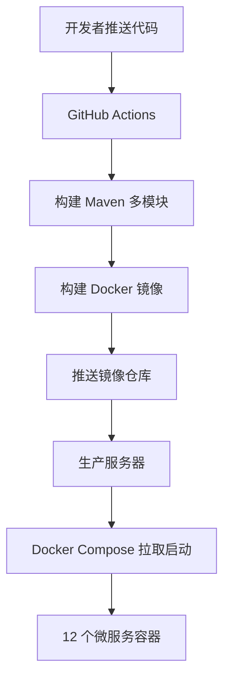

# OpenAtom 微服务 CI/CD 部署文档

> 版本：v1.0  
> 适用范围：微服务多镜像构建、GitHub Actions 流水线、Docker Compose 编排、生产部署  
> 配套文档：《微服务重构开发文档》《AI 搭建基础框架文档》  
> 编写日期：2026-07

---

## 一、文档概述

### 1.1 文档目的

本文档指导微服务架构下的持续集成与持续部署，涵盖：

- 多服务 Docker 镜像构建策略
- GitHub Actions 流水线配置
- 环境变量与 GitHub Secrets 管理
- Docker Compose 生产编排
- 部署与回滚流程

### 1.2 部署架构



### 1.3 关键原则

> 以下原则基于项目已有经验总结：

1. **敏感信息必须通过 GitHub Secrets 注入**，禁止硬编码在配置文件中
2. **GitHub Actions 中避免使用 heredoc 语法**，防止 YAML 解析错误
3. **Docker Compose 需在首次调用前创建 `.env` 文件**，否则环境变量传递失败
4. **部署 Spring Boot 项目需配置 `SPRING_DATASOURCE_URL` Secret**
5. **Docker Compose 环境变量传递需用 `environment` 而非 `env_file` 的某些场景**

---

## 二、镜像构建策略

### 2.1 镜像命名规范

```
{registry}/openatom/{service-name}:{tag}
```

| 项 | 规范 | 示例 |
|----|------|------|
| registry | GitHub Container Registry | `ghcr.io` |
| 服务名 | 与 artifactId 一致 | `auth-service` |
| tag | git SHA + latest | `a1b2c3d`、`latest` |

### 2.2 Dockerfile 统一模板

每个微服务使用统一 Dockerfile（变量替换）：

```dockerfile
# services/{service-name}/Dockerfile
FROM maven:3.9.9-eclipse-temurin-21 AS build
WORKDIR /workspace
COPY services/pom.xml ./pom.xml
COPY services/openatom-common/ ./openatom-common/
RUN mvn -B -q -pl openatom-common -am -DskipTests install
COPY services/{service-name}/ ./{service-name}/
RUN mvn -B -q -pl {service-name} -am -DskipTests package

FROM eclipse-temurin:21-jre-jammy
ENV SPRING_PROFILES_ACTIVE=prod \
    TZ=Asia/Shanghai \
    JAVA_OPTS="-Xms256m -Xmx512m"
WORKDIR /app
COPY --from=build /workspace/{service-name}/target/{service-name}-*.jar /app/app.jar
EXPOSE {port}
ENTRYPOINT ["sh", "-c", "java $JAVA_OPTS -jar /app/app.jar"]
```

> **优化点：** 先单独构建 common 模块作为缓存层，后续服务构建只重建自身。

### 2.3 服务镜像清单

| 服务 | Dockerfile 路径 | 端口 | 镜像名 |
|------|----------------|------|--------|
| gateway-service | `services/gateway-service/Dockerfile` | 8080 | `ghcr.io/openatom/gateway-service` |
| auth-service | `services/auth-service/Dockerfile` | 8101 | `ghcr.io/openatom/auth-service` |
| user-service | `services/user-service/Dockerfile` | 8102 | `ghcr.io/openatom/user-service` |
| club-service | `services/club-service/Dockerfile` | 8103 | `ghcr.io/openatom/club-service` |
| recruitment-service | `services/recruitment-service/Dockerfile` | 8104 | `ghcr.io/openatom/recruitment-service` |
| activity-service | `services/activity-service/Dockerfile` | 8105 | `ghcr.io/openatom/activity-service` |
| blog-service | `services/blog-service/Dockerfile` | 8106 | `ghcr.io/openatom/blog-service` |
| checkin-service | `services/checkin-service/Dockerfile` | 8107 | `ghcr.io/openatom/checkin-service` |
| point-service | `services/point-service/Dockerfile` | 8108 | `ghcr.io/openatom/point-service` |
| notification-service | `services/notification-service/Dockerfile` | 8109 | `ghcr.io/openatom/notification-service` |
| office-service | `services/office-service/Dockerfile` | 8110 | `ghcr.io/openatom/office-service` |
| file-service | `services/file-service/Dockerfile` | 8111 | `ghcr.io/openatom/file-service` |

---

## 三、GitHub Secrets 配置

### 3.1 必需 Secrets 清单

| Secret 名 | 用途 | 示例值 |
|-----------|------|--------|
| `MYSQL_PASSWORD` | MySQL root 密码 | `（自定义强密码）` |
| `REDIS_PASSWORD` | Redis 密码 | `（自定义强密码）` |
| `RABBITMQ_USER` | RabbitMQ 用户名 | `openatom` |
| `RABBITMQ_PASSWORD` | RabbitMQ 密码 | `（自定义强密码）` |
| `NACOS_ADDR` | Nacos 地址 | `nacos:8848` |
| `DEPLOY_HOST` | 生产服务器地址 | `xxx.xxx.xxx.xxx` |
| `DEPLOY_USER` | SSH 用户名 | `deploy` |
| `DEPLOY_SSH_KEY` | SSH 私钥 | `（SSH 私钥内容）` |
| `VITE_API_BASE_URL` | 前端 API 地址 | `/api/v1` |
| `VITE_OIDC_AUTHORITY` | OAuth 地址 | `https://oauth.jmi-openatom.cn/api/v1` |
| `VITE_OIDC_CLIENT_ID` | OAuth 客户端ID | `openatom-web` |

### 3.2 各服务数据库 Secrets

每个服务的数据库连接信息通过环境变量注入：

| Secret 名 | 说明 |
|-----------|------|
| `AUTH_DB_URL` | `jdbc:mysql://mysql:3306/db_auth?...` |
| `AUTH_DB_USERNAME` | `root` |
| `AUTH_DB_PASSWORD` | 同 `MYSQL_PASSWORD` |
| `USER_DB_URL` | `jdbc:mysql://mysql:3306/db_user?...` |
| `USER_DB_USERNAME` | `root` |
| `USER_DB_PASSWORD` | 同 `MYSQL_PASSWORD` |
| `CLUB_DB_URL` | `jdbc:mysql://mysql:3306/db_club?...` |
| ... | 其余服务同理 |

> **注意：** 所有 `*_DB_URL` 必须在 GitHub Secrets 中配置，否则服务启动时无法连接数据库。

### 3.3 Secret 配置步骤

1. 进入 GitHub 仓库 → Settings → Secrets and variables → Actions
2. 点击 `New repository secret`
3. 逐个添加上述 Secret
4. 确认所有 Secret 名称与 docker-compose 中的引用一致

---

## 四、GitHub Actions 工作流

### 4.1 构建流水线

**文件路径：** `.github/workflows/microservices-build.yml`

```yaml
name: Build Microservices

on:
  push:
    branches: [main, develop]
    paths:
      - 'services/**'
      - '.github/workflows/microservices-build.yml'
  pull_request:
    branches: [main]
    paths:
      - 'services/**'

env:
  REGISTRY: ghcr.io
  IMAGE_PREFIX: ghcr.io/${{ github.repository_owner }}/openatom

jobs:
  # 第一步：构建公共模块 + 编译检查
  compile-check:
    runs-on: ubuntu-latest
    steps:
      - uses: actions/checkout@v4
      - uses: actions/setup-java@v4
        with:
          java-version: '21'
          distribution: 'temurin'
          cache: 'maven'
      - name: Compile all modules
        working-directory: services
        run: mvn -B -q -DskipTests compile

  # 第二步：构建并推送镜像（矩阵并行）
  build-images:
    needs: compile-check
    runs-on: ubuntu-latest
    strategy:
      fail-fast: false
      matrix:
        service:
          - gateway-service
          - auth-service
          - user-service
          - club-service
          - recruitment-service
          - activity-service
          - blog-service
          - checkin-service
          - point-service
          - notification-service
          - office-service
          - file-service
    permissions:
      contents: read
      packages: write
    steps:
      - uses: actions/checkout@v4

      - name: Set image tag
        id: tag
        run: echo "sha=${GITHUB_SHA::7}" >> $GITHUB_OUTPUT

      - name: Build image
        run: |
          docker build \
            -f services/${{ matrix.service }}/Dockerfile \
            -t ${{ env.IMAGE_PREFIX }}/${{ matrix.service }}:${{ steps.tag.outputs.sha }} \
            -t ${{ env.IMAGE_PREFIX }}/${{ matrix.service }}:latest \
            .

      - name: Login to registry
        run: echo "${{ secrets.GITHUB_TOKEN }}" | docker login ghcr.io -u ${{ github.actor }} --password-stdin

      - name: Push image
        run: |
          docker push ${{ env.IMAGE_PREFIX }}/${{ matrix.service }}:${{ steps.tag.outputs.sha }}
          docker push ${{ env.IMAGE_PREFIX }}/${{ matrix.service }}:latest
```

> **注意：** 避免在 GitHub Actions 中使用 heredoc 语法（`<<EOF`），会导致 YAML 解析错误。使用多行 `run` 命令时每行单独写。

### 4.2 部署流水线

**文件路径：** `.github/workflows/microservices-deploy.yml`

```yaml
name: Deploy Microservices

on:
  push:
    branches: [main]
    paths:
      - 'services/**'
  workflow_dispatch:
    inputs:
      service:
        description: '指定服务名（留空部署全部）'
        required: false

env:
  DEPLOY_PATH: /opt/openatom-microservices

jobs:
  deploy:
    runs-on: ubuntu-latest
    needs: []
    steps:
      - uses: actions/checkout@v4

      - name: Create .env file
        run: |
          printf "MYSQL_PASSWORD=${{ secrets.MYSQL_PASSWORD }}\n" > .env
          printf "REDIS_PASSWORD=${{ secrets.REDIS_PASSWORD }}\n" >> .env
          printf "RABBITMQ_USER=${{ secrets.RABBITMQ_USER }}\n" >> .env
          printf "RABBITMQ_PASSWORD=${{ secrets.RABBITMQ_PASSWORD }}\n" >> .env
          printf "NACOS_ADDR=${{ secrets.NACOS_ADDR }}\n" >> .env
          printf "AUTH_DB_URL=jdbc:mysql://mysql:3306/db_auth?createDatabaseIfNotExist=true&useUnicode=true&characterEncoding=utf8&serverTimezone=Asia/Shanghai&allowPublicKeyRetrieval=true&useSSL=false\n" >> .env
          printf "AUTH_DB_USERNAME=root\n" >> .env
          printf "AUTH_DB_PASSWORD=${{ secrets.MYSQL_PASSWORD }}\n" >> .env
          printf "USER_DB_URL=jdbc:mysql://mysql:3306/db_user?createDatabaseIfNotExist=true&useUnicode=true&characterEncoding=utf8&serverTimezone=Asia/Shanghai&allowPublicKeyRetrieval=true&useSSL=false\n" >> .env
          printf "USER_DB_USERNAME=root\n" >> .env
          printf "USER_DB_PASSWORD=${{ secrets.MYSQL_PASSWORD }}\n" >> .env
          printf "CLUB_DB_URL=jdbc:mysql://mysql:3306/db_club?createDatabaseIfNotExist=true&useUnicode=true&characterEncoding=utf8&serverTimezone=Asia/Shanghai&allowPublicKeyRetrieval=true&useSSL=false\n" >> .env
          printf "CLUB_DB_USERNAME=root\n" >> .env
          printf "CLUB_DB_PASSWORD=${{ secrets.MYSQL_PASSWORD }}\n" >> .env
          printf "RECRUITMENT_DB_URL=jdbc:mysql://mysql:3306/db_recruitment?createDatabaseIfNotExist=true&useUnicode=true&characterEncoding=utf8&serverTimezone=Asia/Shanghai&allowPublicKeyRetrieval=true&useSSL=false\n" >> .env
          printf "RECRUITMENT_DB_USERNAME=root\n" >> .env
          printf "RECRUITMENT_DB_PASSWORD=${{ secrets.MYSQL_PASSWORD }}\n" >> .env
          printf "ACTIVITY_DB_URL=jdbc:mysql://mysql:3306/db_activity?createDatabaseIfNotExist=true&useUnicode=true&characterEncoding=utf8&serverTimezone=Asia/Shanghai&allowPublicKeyRetrieval=true&useSSL=false\n" >> .env
          printf "ACTIVITY_DB_USERNAME=root\n" >> .env
          printf "ACTIVITY_DB_PASSWORD=${{ secrets.MYSQL_PASSWORD }}\n" >> .env
          printf "BLOG_DB_URL=jdbc:mysql://mysql:3306/db_blog?createDatabaseIfNotExist=true&useUnicode=true&characterEncoding=utf8&serverTimezone=Asia/Shanghai&allowPublicKeyRetrieval=true&useSSL=false\n" >> .env
          printf "BLOG_DB_USERNAME=root\n" >> .env
          printf "BLOG_DB_PASSWORD=${{ secrets.MYSQL_PASSWORD }}\n" >> .env
          printf "CHECKIN_DB_URL=jdbc:mysql://mysql:3306/db_checkin?createDatabaseIfNotExist=true&useUnicode=true&characterEncoding=utf8&serverTimezone=Asia/Shanghai&allowPublicKeyRetrieval=true&useSSL=false\n" >> .env
          printf "CHECKIN_DB_USERNAME=root\n" >> .env
          printf "CHECKIN_DB_PASSWORD=${{ secrets.MYSQL_PASSWORD }}\n" >> .env
          printf "POINT_DB_URL=jdbc:mysql://mysql:3306/db_point?createDatabaseIfNotExist=true&useUnicode=true&characterEncoding=utf8&serverTimezone=Asia/Shanghai&allowPublicKeyRetrieval=true&useSSL=false\n" >> .env
          printf "POINT_DB_USERNAME=root\n" >> .env
          printf "POINT_DB_PASSWORD=${{ secrets.MYSQL_PASSWORD }}\n" >> .env
          printf "NOTIFICATION_DB_URL=jdbc:mysql://mysql:3306/db_notification?createDatabaseIfNotExist=true&useUnicode=true&characterEncoding=utf8&serverTimezone=Asia/Shanghai&allowPublicKeyRetrieval=true&useSSL=false\n" >> .env
          printf "NOTIFICATION_DB_USERNAME=root\n" >> .env
          printf "NOTIFICATION_DB_PASSWORD=${{ secrets.MYSQL_PASSWORD }}\n" >> .env
          printf "OFFICE_DB_URL=jdbc:mysql://mysql:3306/db_office?createDatabaseIfNotExist=true&useUnicode=true&characterEncoding=utf8&serverTimezone=Asia/Shanghai&allowPublicKeyRetrieval=true&useSSL=false\n" >> .env
          printf "OFFICE_DB_USERNAME=root\n" >> .env
          printf "OFFICE_DB_PASSWORD=${{ secrets.MYSQL_PASSWORD }}\n" >> .env
          printf "FILE_DB_URL=jdbc:mysql://mysql:3306/db_file_storage?createDatabaseIfNotExist=true&useUnicode=true&characterEncoding=utf8&serverTimezone=Asia/Shanghai&allowPublicKeyRetrieval=true&useSSL=false\n" >> .env
          printf "FILE_DB_USERNAME=root\n" >> .env
          printf "FILE_DB_PASSWORD=${{ secrets.MYSQL_PASSWORD }}\n" >> .env

      - name: Copy files to server
        uses: appleboy/scp-action@v0.1.7
        with:
          host: ${{ secrets.DEPLOY_HOST }}
          username: ${{ secrets.DEPLOY_USER }}
          key: ${{ secrets.DEPLOY_SSH_KEY }}
          source: "docker-compose.microservices.yml,.env"
          target: ${{ env.DEPLOY_PATH }}

      - name: Deploy on server
        uses: appleboy/ssh-action@v1.0.3
        with:
          host: ${{ secrets.DEPLOY_HOST }}
          username: ${{ secrets.DEPLOY_USER }}
          key: ${{ secrets.DEPLOY_SSH_KEY }}
          script: |
            cd ${{ env.DEPLOY_PATH }}
            docker compose --env-file .env -f docker-compose.microservices.yml pull
            docker compose --env-file .env -f docker-compose.microservices.yml up -d --remove-orphans
            docker image prune -f
```

> **关键：** `.env` 文件必须在 `docker compose` 调用前创建好，否则环境变量传递失败。使用 `printf` 而非 heredoc 写入。

---

## 五、Docker Compose 生产编排

### 5.1 完整生产编排文件

**文件路径：** `docker-compose.microservices.yml`

```yaml
version: "3.8"

services:
  # ============ 基础设施 ============
  mysql:
    image: mysql:8.0
    container_name: openatom-ms-mysql
    environment:
      MYSQL_ROOT_PASSWORD: ${MYSQL_PASSWORD}
      TZ: Asia/Shanghai
    ports:
      - "3306:3306"
    volumes:
      - ms-mysql-data:/var/lib/mysql
    healthcheck:
      test: ["CMD", "mysqladmin", "ping", "-h", "localhost"]
      interval: 10s
      timeout: 5s
      retries: 12
    networks:
      - openatom-ms
    restart: unless-stopped

  redis:
    image: redis:7-alpine
    container_name: openatom-ms-redis
    command: redis-server --requirepass ${REDIS_PASSWORD}
    ports:
      - "6379:6379"
    volumes:
      - ms-redis-data:/data
    healthcheck:
      test: ["CMD", "redis-cli", "-a", "${REDIS_PASSWORD}", "ping"]
      interval: 10s
      timeout: 5s
      retries: 5
    networks:
      - openatom-ms
    restart: unless-stopped

  nacos:
    image: nacos/nacos-server:v2.3.2
    container_name: openatom-ms-nacos
    environment:
      MODE: standalone
      JVM_XMS: 256m
      JVM_XMX: 512m
    ports:
      - "8848:8848"
      - "9848:9848"
    healthcheck:
      test: ["CMD", "curl", "-f", "http://localhost:8848/nacos"]
      interval: 15s
      timeout: 5s
      retries: 10
    networks:
      - openatom-ms
    restart: unless-stopped

  rabbitmq:
    image: rabbitmq:3.13-management
    container_name: openatom-ms-rabbitmq
    environment:
      RABBITMQ_DEFAULT_USER: ${RABBITMQ_USER}
      RABBITMQ_DEFAULT_PASS: ${RABBITMQ_PASSWORD}
    ports:
      - "5672:5672"
      - "15672:15672"
    volumes:
      - ms-rabbitmq-data:/var/lib/rabbitmq
    healthcheck:
      test: ["CMD", "rabbitmq-diagnostics", "ping"]
      interval: 15s
      timeout: 10s
      retries: 6
    networks:
      - openatom-ms
    restart: unless-stopped

  # ============ 微服务 ============
  gateway-service:
    image: ghcr.io/${REGISTRY_OWNER:-openatom}/openatom/gateway-service:latest
    container_name: openatom-gateway
    environment:
      - NACOS_ADDR=${NACOS_ADDR:-nacos:8848}
      - REDIS_HOST=redis
      - REDIS_PORT=6379
      - REDIS_PASSWORD=${REDIS_PASSWORD}
    ports:
      - "8080:8080"
    depends_on:
      nacos:
        condition: service_healthy
      redis:
        condition: service_healthy
    networks:
      - openatom-ms
    restart: unless-stopped

  auth-service:
    image: ghcr.io/${REGISTRY_OWNER:-openatom}/openatom/auth-service:latest
    container_name: openatom-auth
    environment:
      - SPRING_PROFILES_ACTIVE=prod
      - NACOS_ADDR=${NACOS_ADDR:-nacos:8848}
      - AUTH_DB_URL=${AUTH_DB_URL}
      - AUTH_DB_USERNAME=${AUTH_DB_USERNAME}
      - AUTH_DB_PASSWORD=${AUTH_DB_PASSWORD}
      - REDIS_HOST=redis
      - REDIS_PORT=6379
      - REDIS_PASSWORD=${REDIS_PASSWORD}
    depends_on:
      mysql:
        condition: service_healthy
      redis:
        condition: service_healthy
      nacos:
        condition: service_healthy
    networks:
      - openatom-ms
    restart: unless-stopped

  user-service:
    image: ghcr.io/${REGISTRY_OWNER:-openatom}/openatom/user-service:latest
    container_name: openatom-user
    environment:
      - SPRING_PROFILES_ACTIVE=prod
      - NACOS_ADDR=${NACOS_ADDR:-nacos:8848}
      - USER_DB_URL=${USER_DB_URL}
      - USER_DB_USERNAME=${USER_DB_USERNAME}
      - USER_DB_PASSWORD=${USER_DB_PASSWORD}
      - REDIS_HOST=redis
      - REDIS_PORT=6379
      - REDIS_PASSWORD=${REDIS_PASSWORD}
    depends_on:
      mysql:
        condition: service_healthy
      nacos:
        condition: service_healthy
    networks:
      - openatom-ms
    restart: unless-stopped

  # ... 其余服务结构相同，替换服务名/端口/数据库变量
  # club-service (8103), recruitment-service (8104), activity-service (8105)
  # blog-service (8106), checkin-service (8107), point-service (8108)
  # notification-service (8109), office-service (8110), file-service (8111)

volumes:
  ms-mysql-data:
  ms-redis-data:
  ms-rabbitmq-data:

networks:
  openatom-ms:
    driver: bridge
```

### 5.2 服务环境变量映射表

每个微服务在 `environment` 中需注入以下变量：

| 变量 | 说明 | 所有服务共用 |
|------|------|-------------|
| `SPRING_PROFILES_ACTIVE` | `prod` | ✅ |
| `NACOS_ADDR` | Nacos 地址 | ✅ |
| `REDIS_HOST` | `redis` | ✅（除 file-service 外） |
| `REDIS_PORT` | `6379` | ✅ |
| `REDIS_PASSWORD` | Redis 密码 | ✅ |
| `{PREFIX}_DB_URL` | 各服务数据库 URL | ❌ 各自配置 |
| `{PREFIX}_DB_USERNAME` | 数据库用户名 | ❌ |
| `{PREFIX}_DB_PASSWORD` | 数据库密码 | ❌ |

### 5.3 健康检查依赖

启动顺序通过 `depends_on` + `condition: service_healthy` 保证：

```
mysql (healthy) ─┐
redis (healthy) ─┤
nacos (healthy) ─┼──→ 各微服务启动
rabbitmq (healthy)─┘
```

---

## 六、前端构建与部署

### 6.1 前端 Dockerfile

```dockerfile
# frontend/web_pc/Dockerfile
FROM node:20-alpine AS build
WORKDIR /app
RUN corepack enable
COPY frontend/web_pc/package.json frontend/web_pc/pnpm-lock.yaml ./
RUN pnpm install --frozen-lockfile
COPY frontend/web_pc/ ./
RUN pnpm build

FROM nginx:alpine
COPY --from=build /app/dist /usr/share/nginx/html
COPY frontend/web_pc/nginx.conf /etc/nginx/conf.d/default.conf
EXPOSE 80
```

### 6.2 前端 Nginx 配置

```nginx
server {
    listen 80;
    root /usr/share/nginx/html;
    index index.html;

    # SPA 路由回退
    location / {
        try_files $uri $uri/ /index.html;
    }

    # API 反向代理到网关
    location /api/ {
        proxy_pass http://gateway-service:8080;
        proxy_set_header Host $host;
        proxy_set_header X-Real-IP $remote_addr;
        proxy_set_header X-Forwarded-For $proxy_add_x_forwarded_for;
    }

    # 静态资源缓存
    location ~* \.(js|css|png|jpg|jpeg|gif|ico|svg|woff|woff2)$ {
        expires 30d;
        add_header Cache-Control "public, immutable";
    }
}
```

### 6.3 前端 CI

```yaml
  build-frontend:
    runs-on: ubuntu-latest
    steps:
      - uses: actions/checkout@v4
      - uses: actions/setup-node@v4
        with:
          node-version: '20'
      - run: corepack enable
      - working-directory: frontend/web_pc
        run: |
          pnpm install --frozen-lockfile
          pnpm build
      - name: Build and push image
        run: |
          docker build -f frontend/web_pc/Dockerfile -t ghcr.io/openatom/frontend:latest .
          docker push ghcr.io/openatom/frontend:latest
```

---

## 七、部署操作手册

### 7.1 首次部署

```bash
# 1. 在服务器上创建部署目录
mkdir -p /opt/openatom-microservices
cd /opt/openatom-microservices

# 2. 从 GitHub Actions 自动部署（推送代码到 main 分支触发）
#    或手动部署：
docker compose --env-file .env -f docker-compose.microservices.yml pull
docker compose --env-file .env -f docker-compose.microservices.yml up -d

# 3. 验证服务
docker compose ps                    # 查看所有容器状态
curl http://localhost:8080/api/health  # 网关健康检查
curl http://localhost:8848/nacos       # Nacos 控制台
```

### 7.2 更新单个服务

```bash
# 拉取最新镜像
docker compose pull auth-service

# 重启该服务
docker compose up -d auth-service

# 查看日志
docker compose logs -f auth-service
```

### 7.3 滚动更新全部服务

```bash
docker compose pull
docker compose up -d --remove-orphans
docker image prune -f
```

### 7.4 回滚

```bash
# 查看历史镜像
docker images ghcr.io/openatom/auth-service

# 回滚到指定版本（需保留旧 tag）
docker tag ghcr.io/openatom/auth-service:a1b2c3d ghcr.io/openatom/auth-service:latest
docker compose up -d auth-service
```

> 建议：关键版本使用 git SHA 作为 tag，保留至少 3 个历史版本用于回滚。

---

## 八、日志与监控

### 8.1 日志查看

```bash
# 查看单个服务日志
docker compose logs -f auth-service

# 查看所有服务最近 100 行
docker compose logs --tail=100

# 查看指定时间后的日志
docker compose logs --since="2026-07-01T10:00:00"
```

### 8.2 健康检查端点

每个服务暴露 Actuator 健康端点：

```bash
# 直接访问容器内端口
curl http://localhost:8101/actuator/health   # auth-service
curl http://localhost:8102/actuator/health   # user-service
# ... 其余服务同理
```

### 8.3 Nacos 服务列表

访问 `http://localhost:8848/nacos`（账号 nacos / nacos），查看：
- 服务列表：确认 12 个服务全部注册
- 健康状态：确认所有实例为健康状态
- 配置管理：查看各服务动态配置

---

## 九、迁移期部署方案

### 9.1 单体与微服务并存

迁移期间，单体（backend）和微服务同时运行：

```yaml
# docker-compose.yml（现有单体，保留）
services:
  backend:
    build: .
    ports: ["8090:8090"]
    # ... 现有配置

# docker-compose.microservices.yml（新微服务）
services:
  gateway-service:
    ports: ["8080:8080"]
  # ... 微服务
```

### 9.2 Nginx 路由切换

迁移期通过 Nginx 按路径分流：

```nginx
# 已迁移的 API → 微服务网关
location /api/v1/auth/ {
    proxy_pass http://gateway-service:8080;
}
location /api/v1/users/ {
    proxy_pass http://gateway-service:8080;
}

# 未迁移的 API → 单体
location /api/v1/ {
    proxy_pass http://backend:8090;
}
```

> 路由按 `location` 匹配优先级，长前缀优先匹配。

### 9.3 迁移完成后

1. Nginx 全量指向网关 `http://gateway-service:8080`
2. 下线单体容器
3. 清理旧数据库（确认无误后）

---

## 十、常见问题与注意事项

### 10.1 环境变量传递失败

**问题：** Docker Compose 启动时服务拿不到环境变量。

**原因：** `.env` 文件未在 `docker compose` 调用前创建。

**解决：**
```bash
# 确保 .env 文件存在且在同级目录
ls -la .env
# 使用 --env-file 显式指定
docker compose --env-file .env -f docker-compose.microservices.yml up -d
```

### 10.2 数据库连接失败

**问题：** 服务启动报 `Communications link failure`。

**排查：**
1. 确认 MySQL 容器健康：`docker compose ps mysql`
2. 确认 `*_DB_URL` 中 host 为 `mysql`（容器名）
3. 确认 `*_DB_PASSWORD` 与 `MYSQL_PASSWORD` 一致
4. 确认 GitHub Secrets 中已配置对应的 `*_DB_URL`

### 10.3 Nacos 注册失败

**问题：** 服务启动但未注册到 Nacos。

**排查：**
1. 确认 `NACOS_ADDR` 为 `nacos:8848`（容器内访问）
2. 确认 Nacos 容器健康：`docker compose ps nacos`
3. 检查服务日志：`docker compose logs {service-name}`

### 10.4 Flyway 迁移失败

**问题：** 服务启动报 Flyway 迁移错误。

**排查：**
1. 确认迁移文件在 `src/main/resources/db/migration/` 目录
2. 确认文件名按序号递增：`V1__`, `V2__`, `V3__`
3. 确认数据库为新建（首次部署 `createDatabaseIfNotExist=true`）

### 10.5 网关 401 但已登录

**问题：** 前端已登录但请求返回 401。

**排查：**
1. 确认 Redis 中有 Sa-Token 会话：`redis-cli -a {password} KEYS "satoken:*"`
2. 确认前端请求头包含 `Authorization: Bearer {token}`
3. 确认网关和 auth-service 连接同一 Redis 实例

---

## 附录：部署检查清单

| 序号 | 检查项 | 命令/方法 |
|------|--------|-----------|
| 1 | GitHub Secrets 配置完整 | Settings → Secrets 逐项核对 |
| 2 | .env 文件已创建 | `ls -la .env` |
| 3 | 基础设施容器健康 | `docker compose ps` |
| 4 | 12 个微服务已注册 Nacos | Nacos 控制台服务列表 |
| 5 | 网关可访问 | `curl http://localhost:8080/api/health` |
| 6 | 登录流程正常 | `POST /api/v1/auth/login` |
| 7 | 前端可访问 | `curl http://localhost:18080` |
| 8 | Flyway 建表完成 | MySQL 各库有对应表 |
| 9 | Redis 会话正常 | `redis-cli KEYS "satoken:*"` |
| 10 | RabbitMQ 队列创建 | RabbitMQ 控制台 Queues 标签页 |

---

> 本文档为微服务 CI/CD 部署指南，架构设计请参考《微服务重构开发文档》，脚手架生成请参考《AI 搭建基础框架文档》，API 定义请参考《API 契约与接口规约文档》。
