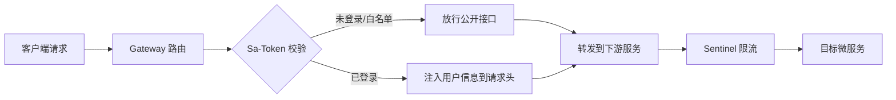

# OpenAtom 微服务重构开发文档

> 版本：v1.0  
> 适用范围：openatom-system 主系统由单体架构重构为微服务架构（不含 LMS）  
> 编写日期：2026-07

---

## 一、文档概述

### 1.1 文档目的

本文档是 OpenAtom 主系统从单体架构（Spring Boot 单体）向微服务架构重构的**完整开发指南**，面向开发人员和 AI 编程助手，涵盖：

- 现状分析与重构目标
- 微服务总体架构设计与服务拆分方案
- 技术选型与基础设施
- 数据库拆分与数据迁移策略
- 网关、认证、服务间通信方案
- 分阶段迁移路线图
- 开发规范与约定

### 1.2 重构目标

| 目标 | 说明 |
|------|------|
| 服务自治 | 各业务服务独立开发、独立部署、独立扩缩容 |
| 弹性扩展 | 高频服务（签到、招新）可单独扩容，不影响其他模块 |
| 故障隔离 | 单一服务故障不导致全局不可用 |
| 技术演进 | 为后续接入更多业务提供标准化骨架 |
| 平滑迁移 | 分阶段剥离，期间单体与微服务可并存 |

### 1.3 术语约定

- **CMS**：主系统（Club Management System），即当前 `backend/` 单体应用
- **服务名**：统一使用 `xxx-service` 命名（如 `auth-service`）
- **模块名**：Maven artifactId 统一使用 `openatom-xxx` 前缀

---

## 二、现状分析

### 2.1 当前架构

```
openatom-system (单体)
├── backend/                     ← CMS 主系统，单体 Spring Boot 3.3.12
│   ├── 25 个 Controller          ← 用户/社团/招新/活动/博客/签到/积分/通知/文书/AI...
│   ├── 约 30+ 张表（单库 openatom-system）
│   ├── Sa-Token + MyBatis-Plus + Redis + Flyway
│   └── AstrBot QQ 机器人联动
├── frontend/ (web_pc / uni_app / ios_app)
└── docs-site/ (VuePress)
```

### 2.2 现存痛点

1. **单体耦合严重**：`UserServiceImpl` 单类注入 11 个 Mapper，跨域逻辑高度耦合
2. **资源无法按需分配**：签到高峰期整个应用受影响
3. **部署粒度粗**：任何小改动需整体重新构建部署
4. **数据库耦合**：30+ 张表集中在单库，跨业务联表查询难以拆分
5. **扩展性受限**：缺乏统一的服务治理能力

### 2.3 可复用资产

| 资产 | 复用方式 |
|------|----------|
| Sa-Token 权限体系 | 提取为独立的 auth-service |
| Flyway 迁移机制 | 每个微服务独立维护自己的迁移脚本 |
| Docker Compose 部署 | 扩展为多服务编排 |
| 现有 REST API 契约 | 网关层保持 API 路径兼容，降低前端改动 |
| MyBatis-Plus + Lombok 技术栈 | 全量保留，各服务一致 |

---

## 三、微服务总体架构设计

### 3.1 架构全景

```mermaid
graph TB
    Client[前端: Web/小程序/iOS]
    Client --> Gateway[Gateway 网关 :8080]

    Gateway --> AuthService[auth-service 认证授权]
    Gateway --> UserService[user-service 用户]
    Gateway --> ClubService[club-service 社团组织]
    Gateway --> RecruitService[recruitment-service 招新]
    Gateway --> ActivityService[activity-service 活动报名]
    Gateway --> BlogService[blog-service 博客内容]
    Gateway --> CheckinService[checkin-service 签到]
    Gateway --> PointService[point-service 积分]
    Gateway --> NotifyService[notification-service 通知]
    Gateway --> OfficeService[office-service 办公文书]
    Gateway --> FileService[file-service 文件存储]

    AuthService --> Nacos[(Nacos 注册/配置中心)]
    UserService --> Nacos
    ClubService --> Nacos
    RecruitService --> Nacos
    ActivityService --> Nacos
    BlogService --> Nacos
    CheckinService --> Nacos
    PointService --> Nacos
    NotifyService --> Nacos
    OfficeService --> Nacos
    FileService --> Nacos

    AuthService --> Redis[(Redis 共享会话)]
    NotifyService --> RabbitMQ[(RabbitMQ 消息队列)]
    PointService --> RabbitMQ
    CheckinService --> RabbitMQ
    RecruitService --> RabbitMQ

    AuthService --> DBAuth[(DB: db_auth)]
    UserService --> DBUser[(DB: db_user)]
    ClubService --> DBClub[(DB: db_club)]
    RecruitService --> DBRecruit[(DB: db_recruitment)]
    ActivityService --> DBActivity[(DB: db_activity)]
    BlogService --> DBBlog[(DB: db_blog)]
    CheckinService --> DBCheckin[(DB: db_checkin)]
    PointService --> DBPoint[(DB: db_point)]
    NotifyService --> DBNotify[(DB: db_notification)]
    OfficeService --> DBOffice[(DB: db_office)]
    FileService --> DBFile[(DB: db_file_storage)]
```



### 3.2 服务拆分策略

采用 **DDD 领域驱动 + 业务边界** 拆分，遵循以下原则：

1. **高内聚低耦合**：同一业务领域的表归入同一服务
2. **独立数据库**：每个服务独占一个 Database，禁止跨库 JOIN
3. **单一职责**：一个服务只负责一个业务域
4. **流量导向**：高频/高并发模块单独拆分（签到、积分）
5. **渐进迁移**：优先拆分边界清晰的域，逐步剥离

---

## 四、服务拆分方案

### 4.1 服务清单总览

| 序号 | 服务名 | 端口 | 数据库 | 核心职责 | 对应原 Controller |
|------|--------|------|--------|----------|-------------------|
| 1 | auth-service | 8101 | db_auth | 登录、注册、Token、RBAC 权限 | OidcController, OauthClientController |
| 2 | user-service | 8102 | db_user | 用户 CRUD、Excel 导入导出、头像 | (原 UserController 内逻辑) |
| 3 | club-service | 8103 | db_club | 社团、部门、岗位、成员、退社、获奖 | ClubController, DepartmentController, AlumniGroupController, AwardController, ClubRegulationController |
| 4 | recruitment-service | 8104 | db_recruitment | 招新计划、入会申请、审批、面试、信息表单 | ApplicationController, ApprovalController, InterviewController, SiteFormController, FormSubmissionController |
| 5 | activity-service | 8105 | db_activity | 活动发布、报名、签到场次关联 | (原 ActivityController 逻辑) |
| 6 | blog-service | 8106 | db_blog | 博客文章、评论、互动 | BlogController |
| 7 | checkin-service | 8107 | db_checkin | 签到场次、分组、记录 | (原 CheckinController 逻辑) |
| 8 | point-service | 8108 | db_point | 积分账户、流水、兑换 | PointController |
| 9 | notification-service | 8109 | db_notification | 站内通知、已读管理 | NotificationController |
| 10 | office-service | 8110 | db_office | 办公文书生成与导出 | DocumentTemplateController |
| 11 | file-service | 8111 | db_file_storage | 图床、文件上传 | ImageHostingController |
| 12 | gateway-service | 8080 | — | API 网关、路由、限流、鉴权前置 | — |
| — | openatom-common | — | — | 公共依赖（工具类、DTO、Result） | — |

### 4.2 各服务详细说明

#### 4.2.1 auth-service（认证授权服务）

**职责边界：**
- 用户登录 / 注册 / 退出
- Sa-Token 会话管理（Token 签发与校验）
- RBAC：角色（sys_role）、权限（sys_permission）、角色权限（sys_role_permission）、用户角色（sys_user_role）
- OAuth 2.0 / OIDc 客户端管理（oauth_client）
- 权限码初始化与种子数据

**数据库表（db_auth）：**
- `sys_role`、`sys_permission`、`sys_role_permission`、`sys_user_role`
- OAuth 客户端表

**对外 API：**
- `POST /auth/login`、`POST /auth/logout`、`GET /auth/me`
- `GET/POST/DELETE /oauth-clients`

**关键设计：**
- Sa-Token 会话存储在 **共享 Redis** 中，所有服务通过同一 Redis 校验登录态
- `SaPermissionInterfaceImpl` 留在此服务，权限数据通过内部接口暴露给其他服务（或下沉到网关鉴权）

#### 4.2.2 user-service（用户服务）

**职责边界：**
- 用户基础信息 CRUD（tb_user）
- 用户状态管理（启用/禁用/锁定）
- 密码重置
- Excel 批量导入导出用户
- 头像存储

**数据库表（db_user）：**
- `tb_user`（用户主表）
- `login_log`（登录日志）

**对外 API：**
- `GET/POST /users`、`GET/PATCH /users/{userId}`
- `POST /users/{userId}/reset-password`
- `POST /users/import`

**关键设计：**
- 用户 ID 是全系统的"公共主键"，其他服务通过 Feign 调用 user-service 获取用户详情
- 密码加密逻辑（spring-security-crypto SHA-256）保留在此服务

#### 4.2.3 club-service（社团组织服务）

**职责边界：**
- 社团管理（club）
- 部门管理（club_department）
- 岗位管理（club_position、club_position_role）
- 成员管理（club_membership）
- 退社申请（exit_application）
- 社团获奖（club_award）
- 社团规章（club_regulation）
- 往届管理人员分组

**数据库表（db_club）：**
- `club`、`club_department`、`club_position`、`club_position_role`
- `club_membership`、`exit_application`、`club_award`

**对外 API：**
- `GET/POST/PATCH /clubs`、`/clubs/{clubId}/departments`、`/clubs/{clubId}/positions`
- `GET/POST /memberships`、`/exit-applications`、`/awards`

#### 4.2.4 recruitment-service（招新服务）

**职责边界：**
- 招新计划管理（recruitment_campaign）
- 入会申请（membership_application）
- 审批流程（approval_record）
- 面试安排与反馈（interview、interview_interviewer、interview_feedback）
- 信息收集表单（site_form、form_submission）

**数据库表（db_recruitment）：**
- `recruitment_campaign`、`membership_application`、`approval_record`
- `interview`、`interview_interviewer`、`interview_feedback`
- `site_form`、`form_submission`

**关键设计：**
- 招新审批通过后，通过事件通知 club-service 创建成员关系（解耦）

#### 4.2.5 activity-service（活动服务）

**职责边界：**
- 活动发布与管理（club_activity）
- 活动报名（activity_registration）
- 活动与签到场次的关联引用

**数据库表（db_activity）：**
- `club_activity`、`activity_registration`

**关键设计：**
- 报名后通过事件通知 point-service 发放参与积分

#### 4.2.6 blog-service（博客内容服务）

**职责边界：**
- 博客文章（blog_article）
- 评论（blog_comment）
- 互动记录（blog_article_interaction：点赞/收藏/分享）

**数据库表（db_blog）：**
- `blog_article`、`blog_comment`、`blog_article_interaction`

**关键设计：**
- 文章审核通过后通过事件通知 point-service 奖励积分

#### 4.2.7 checkin-service（签到服务）

**职责边界：**
- 签到场次（checkin_session）
- 签到分组（checkin_group、checkin_group_member）
- 签到发放人员（checkin_target）
- 签到记录（checkin_record）

**数据库表（db_checkin）：**
- `checkin_session`、`checkin_group`、`checkin_group_member`
- `checkin_target`、`checkin_record`

**关键设计：**
- 高并发场景独立部署，签到成功后异步通知 point-service 发放积分

#### 4.2.8 point-service（积分服务）

**职责边界：**
- 积分账户（point_account）
- 积分流水（point_transaction）
- 兑换商品（point_redeem_item）
- 兑换记录（point_redemption）

**数据库表（db_point）：**
- `point_account`、`point_transaction`、`point_redeem_item`、`point_redemption`

**关键设计：**
- 消费 RabbitMQ 事件实现积分发放（幂等键 `source_key` 防重）
- 每日登录积分、活动参与积分、博客发布积分均通过事件触发

#### 4.2.9 notification-service（通知服务）

**职责边界：**
- 站内通知（notification）
- 接收人管理（notification_receiver）
- 已读状态管理

**数据库表（db_notification）：**
- `notification`、`notification_receiver`

**关键设计：**
- 消费各业务事件自动生成通知（招新结果、审批通知、积分变动等）

#### 4.2.10 office-service（办公文书服务）

**职责边界：**
- 办公文书管理（office_document）
- 文书模板配置
- 基于 POI 的文书导出

**数据库表（db_office）：**
- `office_document`

**关键设计：**
- 模板渲染依赖 club-service 和 user-service 的数据，通过 Feign 调用获取

#### 4.2.11 file-service（文件存储服务）

**职责边界：**
- 图床资产管理（image_hosting_asset）
- 图片/文件上传与删除
- 统一文件 URL 生成

**数据库表（db_file_storage）：**
- `image_hosting_asset`

#### 4.2.12 gateway-service（网关服务）

**职责边界：**
- 统一入口路由
- Sa-Token 登录态前置校验
- 限流（Sentinel）
- 跨域处理
- API 路径兼容（保持前端无感知）

**路由规则示例：**
```
/api/auth/**      → auth-service
/api/users/**     → user-service
/api/clubs/**     → club-service
/api/memberships/** → club-service
/api/applications/** → recruitment-service
/api/activities/** → activity-service
/api/blog/**      → blog-service
/api/checkin/**   → checkin-service
/api/points/**    → point-service
/api/notifications/** → notification-service
/api/office-documents/** → office-service
/api/files/**     → file-service
```

---

## 五、技术选型

### 5.1 技术栈总表

| 层面 | 技术 | 版本 | 说明 |
|------|------|------|------|
| 基础框架 | Spring Boot | 3.3.12 | 与现有保持一致 |
| Java 版本 | JDK | 21 | 与现有保持一致 |
| 微服务框架 | Spring Cloud | 2023.0.x | 对应 Spring Boot 3.3 |
| 注册/配置中心 | Nacos | 2.3.x | 服务发现 + 动态配置 |
| 网关 | Spring Cloud Gateway | 2023.0.x | 响应式网关 |
| 服务间调用 | OpenFeign | 2023.0.x | 声明式 HTTP 客户端 |
| 消息队列 | RabbitMQ | 3.13 | 事件驱动，与现有一致 |
| 熔断限流 | Sentinel | 1.3.x | 流控/熔断/热点限流 |
| 链路追踪 | Micrometer Tracing + Zipkin | — | Spring Boot 原生集成 |
| 权限框架 | Sa-Token | 1.37.0 | 与现有保持一致 |
| 持久层 | MyBatis-Plus | 3.5.5 | 与现有保持一致 |
| 数据库 | MySQL | 8.0 | 与现有保持一致 |
| 缓存 | Redis | 7.x | 共享会话 + 缓存 |
| 数据库迁移 | Flyway | — | 每服务独立迁移 |
| 构建 | Maven | 3.9+ | 多模块管理 |
| 容器 | Docker + Docker Compose | — | 开发与部署一致 |

### 5.2 选型理由

- **Nacos**：同时承担注册中心和配置中心，减少组件数量；社区活跃，中文文档丰富
- **OpenFeign**：声明式调用，代码可读性高，适合内部服务间 HTTP 通信
- **RabbitMQ**：项目已有使用经验（LMS 已集成），事件驱动成熟
- **Sentinel**：与 Spring Cloud 生态集成好，网关层限流 + 服务层熔断
- **Sa-Token**：保留现有权限体系，网关层做 Token 校验，各服务通过共享 Redis 获取会话

---

## 六、数据库拆分方案

### 6.1 拆分原则

1. **每服务独立库**：一个微服务对应一个 Database
2. **禁止跨库 JOIN**：跨服务数据通过 Feign 调用或数据冗余
3. **外键变逻辑引用**：原外键关系变为存储 ID，由应用层保证一致性
4. **公共主键不变**：`user_id`、`club_id` 等在各库中仅存储 ID 值

### 6.2 库与表映射

| 数据库 | 归属服务 | 包含表 |
|--------|----------|--------|
| db_auth | auth-service | sys_role, sys_permission, sys_role_permission, sys_user_role, oauth_client |
| db_user | user-service | tb_user, login_log |
| db_club | club-service | club, club_department, club_position, club_position_role, club_membership, exit_application, club_award |
| db_recruitment | recruitment-service | recruitment_campaign, membership_application, approval_record, interview, interview_interviewer, interview_feedback, site_form, form_submission |
| db_activity | activity-service | club_activity, activity_registration |
| db_blog | blog-service | blog_article, blog_comment, blog_article_interaction |
| db_checkin | checkin-service | checkin_session, checkin_group, checkin_group_member, checkin_target, checkin_record |
| db_point | point-service | point_account, point_transaction, point_redeem_item, point_redemption |
| db_notification | notification-service | notification, notification_receiver |
| db_office | office-service | office_document |
| db_file_storage | file-service | image_hosting_asset |
| db_system | 公共 | system_setting, operation_log |

> `system_setting` 和 `operation_log` 可放入独立的 system-service 或归入网关层管理。初期可先放入 user-service 或单独保留。

### 6.3 数据迁移策略

采用 **双写 + 影子验证 + 流量切换** 三阶段迁移：

1. **阶段一：建库建表**
   - 按拆分方案创建各微服务数据库
   - 将原 `create_table.sql` 按域拆分为各服务的 Flyway 迁移脚本

2. **阶段二：数据同步**
   - 使用脚本将单体库数据按表复制到对应微服务库
   - 保持 ID 不变，确保引用关系不断裂

3. **阶段三：流量切换**
   - 网关逐步将流量从单体切换到微服务
   - 切换期间双写保证数据一致，验证无误后下线单体

### 6.4 Flyway 迁移规范

每个微服务在 `src/main/resources/db/migration/` 下维护独立迁移脚本：

```
auth-service/
  src/main/resources/db/migration/
    V1__create_auth_tables.sql
    V2__init_permissions.sql
    V3__init_roles.sql
```

命名规则：`V{序号}__{描述}.sql`，序号必须递增（参考已有经验：Flyway 迁移文件必须按序号递增并放指定目录）。

---

## 七、公共组件设计

### 7.1 openatom-common 模块

所有微服务共享的公共依赖，统一管理：

```
openatom-common/
├── pom.xml
└── src/main/java/edu/jmi/openatom/common/
    ├── result/          ← Result 统一响应体、PageDataVO
    ├── exception/       ← 全局异常码、BusinessException
    ├── constant/        ← 常量定义（头信息、缓存键前缀）
    ├── feign/           ← 通用 Feign 配置、上下文传递拦截器
    ├── security/        ← Sa-Token 上下文工具、用户信息持有者
    ├── mybatis/         ← MyBatis-Plus 配置基类、自动填充
    └── util/            ← 工具类
```

### 7.2 统一响应体

保持与现有 `Result<T>` 一致，所有服务返回统一格式：

```json
{ "code": 200, "message": "success", "data": {} }
```

### 7.3 Feign 上下文传递

通过 Feign 拦截器自动传递 Sa-Token 和请求头（traceId、userId），确保服务间调用时登录态不断裂：

```java
@Component
public class FeignAuthInterceptor implements RequestInterceptor {
    @Override
    public void apply(RequestTemplate template) {
        // 传递 Sa-Token
        ServletRequestAttributes attrs = (ServletRequestAttributes) RequestContextHolder.getRequestAttributes();
        if (attrs != null) {
            HttpServletRequest request = attrs.getRequest();
            String token = request.getHeader("Authorization");
            if (token != null) template.header("Authorization", token);
        }
    }
}
```

### 7.4 用户上下文工具

各服务通过共享 Redis 中的 Sa-Token 会话获取当前用户 ID，无需每次调用 auth-service：

```java
public class UserContext {
    public static Long getCurrentUserId() {
        return StpUtil.getLoginIdAsLong();
    }
}
```

---

## 八、网关与认证方案

### 8.1 网关架构



### 8.2 网关职责

1. **路由转发**：按路径前缀路由到对应微服务
2. **登录态校验**：通过 Sa-Token 在网关层校验 Token，白名单接口放行
3. **权限前置**：网关层校验 `@SaCheckPermission` 对应的路径权限码
4. **限流熔断**：Sentinel 在网关层做全局限流
5. **跨域处理**：统一 CORS 配置

### 8.3 认证流程

1. 客户端调用 `POST /api/auth/login` → 网关路由到 auth-service
2. auth-service 校验账号密码，调用 `StpUtil.login(userId)` 写入 Redis
3. 返回 Token 给客户端
4. 后续请求携带 Token → 网关校验 Token 有效性 → 注入 userId 到下游 Header
5. 下游服务从 Header 或 `StpUtil` 获取当前用户

### 8.4 白名单接口

以下接口不需要登录态校验：
- `POST /api/auth/login`、`POST /api/auth/register`
- `GET /api/site/**`（前台公开接口：社团主页、活动列表、招新信息）
- `GET /api/blog/articles/**`（公开博客文章）
- `GET /api/health/**`

---

## 九、服务间通信与事件驱动

### 9.1 同步调用（OpenFeign）

用于需要实时响应的场景，定义 Feign 接口：

| 调用方 | 被调方 | 场景 | 方法 |
|--------|--------|------|------|
| club-service | user-service | 根据用户ID批量查用户信息 | `GET /users/batch?ids=xxx` |
| recruitment-service | club-service | 审批通过后创建成员 | `POST /memberships` |
| office-service | user-service | 导出文书时查用户信息 | `GET /users/{userId}` |
| office-service | club-service | 导出文书时查社团信息 | `GET /clubs/{clubId}` |
| activity-service | club-service | 查活动关联社团信息 | `GET /clubs/{clubId}` |

### 9.2 异步事件（RabbitMQ）

用于解耦、不需要实时响应的场景：

| 事件 | 发布者 | 消费者 | 说明 |
|------|--------|--------|------|
| `member.created` | recruitment-service | notification-service | 成员创建后发通知 |
| `point.award` | checkin-service | point-service | 签到成功发放积分 |
| `point.award` | activity-service | point-service | 活动参与发放积分 |
| `point.award` | blog-service | point-service | 博客审核通过奖励 |
| `notification.send` | 各业务服务 | notification-service | 统一通知入口 |
| `user.login` | auth-service | point-service | 每日首次登录积分 |

### 9.3 事件消息格式

统一事件信封：

```json
{
  "eventType": "point.award",
  "userId": 123,
  "sourceType": "checkin",
  "sourceId": 456,
  "sourceKey": "checkin:456:user:123",
  "delta": 2,
  "description": "扫码签到奖励",
  "timestamp": "2026-07-01T10:00:00Z"
}
```

> `sourceKey` 作为幂等键，point-service 消费时校验防重。

---

## 十、部署架构

### 10.1 开发环境（Docker Compose）

```yaml
# docker-compose.microservices.yml (示意)
services:
  mysql:
    image: mysql:8.0
    environment:
      MYSQL_ROOT_PASSWORD: ${MYSQL_PASSWORD}
    ports: ["3306:3306"]

  redis:
    image: redis:7-alpine
    ports: ["6379:6379"]

  nacos:
    image: nacos/nacos-server:v2.3.2
    environment:
      MODE: standalone
    ports: ["8848:8848", "9848:9848"]

  rabbitmq:
    image: rabbitmq:3.13-management
    ports: ["5672:5672", "15672:15672"]

  gateway-service:
    build: ./services/gateway-service
    ports: ["8080:8080"]
    depends_on: [nacos]

  auth-service:
    build: ./services/auth-service
    depends_on: [mysql, redis, nacos]

  # ... 其他服务
```

### 10.2 服务端口规划

| 组件 | 端口 |
|------|------|
| Gateway 网关 | 8080 |
| Nacos | 8848 / 9848 |
| RabbitMQ | 5672 / 15672 |
| MySQL | 3306 |
| Redis | 6379 |
| auth-service | 8101 |
| user-service | 8102 |
| club-service | 8103 |
| recruitment-service | 8104 |
| activity-service | 8105 |
| blog-service | 8106 |
| checkin-service | 8107 |
| point-service | 8108 |
| notification-service | 8109 |
| office-service | 8110 |
| file-service | 8111 |

### 10.3 生产部署

- 每个微服务构建独立 Docker 镜像
- 敏感配置（数据库密码、Redis 密码等）通过环境变量注入（遵循现有规范：生产环境敏感信息必须通过 GitHub Secrets 注入）
- CI/CD 流程：每个服务独立构建和部署（参考现有 `.github/workflows/`）

---

## 十一、分阶段迁移路线图

### 阶段零：基础设施搭建（1-2 周）

- 搭建 Nacos、RabbitMQ 基础设施
- 创建 `openatom-cloud` 父 POM 工程
- 创建 `openatom-common` 公共模块
- 创建 `gateway-service` 网关骨架
- 验证服务注册发现 + 网关路由

### 阶段一：边缘服务剥离（2-3 周）

优先拆分边界清晰、依赖少的非核心服务：

1. **file-service**（图床，无复杂依赖）
2. **notification-service**（通知，消费事件即可）
3. **blog-service**（博客，相对独立）

此阶段网关与单体并存：网关将部分流量路由到新服务，其余仍转发到单体。

### 阶段二：核心域剥离（3-4 周）

1. **auth-service** + **user-service**（认证和用户是基础，优先拆）
2. **club-service**（社团组织，核心域）
3. **point-service**（积分，事件驱动消费方）

### 阶段三：业务域剥离（2-3 周）

1. **recruitment-service**（招新，依赖 club 和 user）
2. **activity-service**（活动报名）
3. **checkin-service**（签到，高频独立部署）
4. **office-service**（办公文书）

### 阶段四：收尾（1 周）

- 下线单体应用
- 网关路由全量切换
- 清理遗留的数据库旧表
- 完善监控告警

---

## 十二、开发规范

### 12.1 模块目录结构

每个微服务统一目录结构：

```
auth-service/
├── pom.xml
└── src/main/
    ├── java/edu/jmi/openatom/auth/
    │   ├── AuthApplication.java        ← 启动类
    │   ├── controller/                 ← REST 接口
    │   ├── service/                    ← 业务逻辑
    │   │   └── impl/
    │   ├── mapper/                     ← MyBatis-Plus Mapper
    │   ├── entity/                     ← 数据库实体
    │   ├── dto/                        ← 请求 DTO
    │   ├── vo/                         ← 响应 VO
    │   ├── config/                     ← 服务配置
    │   └── feign/                      ← Feign 客户端（调用其他服务）
    └── resources/
        ├── application.yml             ← 主配置
        ├── application-dev.yml         ← 开发环境
        ├── application-prod.yml        ← 生产环境
        └── db/migration/               ← Flyway 迁移脚本
```

### 12.2 包命名规范

- 基础包：`edu.jmi.openatom.{服务名简写}`（如 `edu.jmi.openatom.auth`）
- 子包：`controller`、`service`、`service.impl`、`mapper`、`entity`、`dto`、`vo`、`config`、`feign`

### 12.3 接口路径规范

- 统一前缀 `/api/{服务名简写}/`
- RESTful 风格，保持与现有 API 路径兼容
- 示例：`/api/clubs/{clubId}/departments`

### 12.4 代码规范

- 变量命名 camelCase（遵循现有规范）
- 类命名 PascalCase
- Lombok 注解简化代码（`@RequiredArgsConstructor`、`@Data`）
- 全局异常处理统一在 common 模块
- 所有对外接口返回 `Result<T>` 统一响应体

### 12.5 数据库规范

- 表名 snake_case，复数语义（如 `club_membership`）
- 字段名 snake_case
- 每个表必须有 `created_at` 时间戳
- 状态字段统一使用 VARCHAR + 语义值（如 `'active'`、`'draft'`）
- 迁移脚本必须按序号递增，放在 `db/migration/` 目录

### 12.6 环境变量规范

所有敏感配置通过环境变量注入，禁止硬编码：

```yaml
spring:
  datasource:
    url: ${AUTH_DB_URL:jdbc:mysql://127.0.0.1:3306/db_auth}
    username: ${AUTH_DB_USERNAME:root}
    password: ${AUTH_DB_PASSWORD:123456}
```

---

## 十三、监控与运维

### 13.1 健康检查

每个微服务暴露 Spring Boot Actuator 健康端点：

```yaml
management:
  endpoints:
    web:
      exposure:
        include: health,info,metrics
```

### 13.2 链路追踪

使用 Micrometer Tracing + Zipkin，在 common 模块统一引入依赖，自动注入 traceId。

### 13.3 日志规范

- 统一 JSON 格式日志
- 每条日志携带 traceId、serviceName
- 日志输出到 stdout，由 Docker 收集

---

## 附录 A：原 Controller 到微服务映射速查表

| 原 Controller | 目标服务 |
|---------------|----------|
| OidcController | auth-service |
| OauthClientController | auth-service |
|（用户相关逻辑） | user-service |
| ClubController | club-service |
| DepartmentController | club-service |
| AlumniGroupController | club-service |
| AwardController | club-service |
| ClubRegulationController | club-service |
| ApplicationController | recruitment-service |
| ApprovalController | recruitment-service |
| InterviewController | recruitment-service |
| SiteFormController | recruitment-service |
| FormSubmissionController | recruitment-service |
| SiteController | activity-service（前台聚合） |
| BlogController | blog-service |
|（签到相关逻辑） | checkin-service |
| PointController | point-service |
| NotificationController | notification-service |
| DocumentTemplateController | office-service |
| ImageHostingController | file-service |
| LotteryController | activity-service |
| SchoolCalendarController | activity-service |
| DataOpenController | 网关聚合 / 独立 |
| AiSettingsController | 独立 ai-service（可选） |
| AiActivityAutomationController | 独立 ai-service（可选） |
| BotManagementController | 独立 bot-service（可选） |
| ShowcaseAppController | 独立 showcase-service（可选） |

## 附录 B：事件清单速查

| 事件名 | Exchange / Queue | 发布者 | 消费者 |
|--------|------------------|--------|--------|
| point.award | exchange: point / queue: point.award | checkin / activity / blog / auth | point-service |
| notification.send | exchange: notification / queue: notification.send | 各业务服务 | notification-service |
| member.created | exchange: club / queue: club.member.created | recruitment-service | notification-service |

---

> 本文档为微服务重构的指导性文件，具体实施请配合《AI 搭建基础框架文档》使用，后者提供了 AI 编程助手可直接执行的脚手架生成指令。
