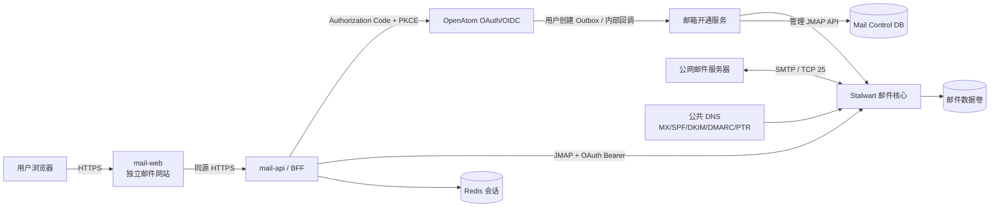
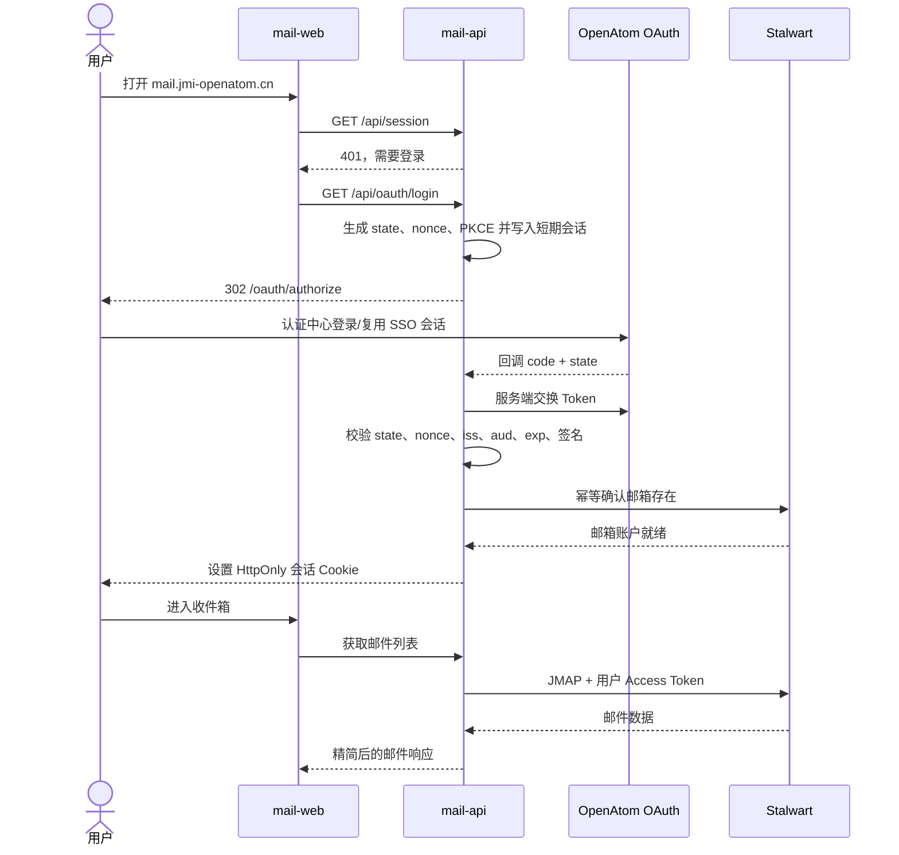
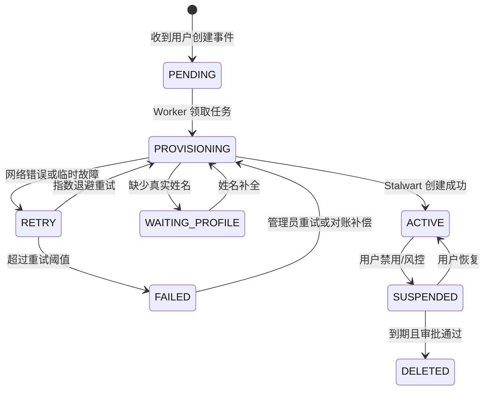

# OpenAtom 独立自建邮件网站技术方案

> 文档状态：方案评审稿  
> 编写日期：2026-07-30  
> 适用项目：OpenAtom System 及拟新建的 OpenAtom Mail  
> 建议站点：`https://mail.jmi-openatom.cn`

## 1. 结论

建议将邮件能力建设为一个独立网站和独立服务，而不是继续塞入当前 OpenAtom System 单体应用：

- 使用 `mail.jmi-openatom.cn` 提供独立 Web 邮箱。
- 使用现有 `oauth.jmi-openatom.cn` 作为唯一身份源，采用 OAuth 2.0 Authorization Code + PKCE 登录；邮件站不保存 OpenAtom 用户密码。
- 使用 Stalwart 作为自建邮件核心，负责 SMTP 收发、队列、邮件存储、JMAP/IMAP、DKIM 及垃圾邮件过滤。
- 新建 `mail-web`（Vue 3）和 `mail-api`（Spring Boot BFF）。浏览器只持有邮件站会话 Cookie，由 `mail-api` 代表用户访问 JMAP，避免把 Refresh Token 暴露给前端。
- `mail-web` 的 UI/UX 必须与 OpenAtom 主站保持一致，复用主站的颜色、字体、圆角、阴影、间距和深浅色主题语义，并在桌面端与移动端保持同一交互语言。
- 新用户创建后，由主系统通过事务型 Outbox 异步通知邮件站预创建邮箱；用户首次 OAuth 登录时再执行一次幂等补建。
- 公网发信不使用第三方 SMTP Relay，由自建 MTA 直接投递到收件方 MX；公网收信由本机 TCP 25 端口直接接收。

推荐的第一版组合为：

| 层次 | 选型 | 主要职责 |
| --- | --- | --- |
| 独立网站 | Vue 3 + Vite | 邮件列表、阅读、写信、搜索、响应式布局和主站一致的视觉体系 |
| 邮件站 BFF | Spring Boot 3 + Java 21 | OAuth 回调、会话、邮箱开通、JMAP 代理、审计 |
| 邮件核心 | Stalwart | SMTP、JMAP、IMAP、队列、存储、反垃圾、DKIM |
| 身份中心 | 现有 OpenAtom OAuth/OIDC | 统一登录、Token、用户身份与状态 |
| 控制面数据 | 独立 MySQL Schema | 用户与邮箱映射、开通任务、审计记录 |
| 会话与任务 | Redis | BFF 会话、短期状态、任务锁、限流 |

> 关键边界：这里的“不依赖外部邮件服务器”表示不购买或调用第三方 SMTP/IMAP 邮件服务。公网邮件本身仍依赖域名、公共 DNS、对端邮件服务器、互联网链路和服务器公网 IP。若服务器供应商封禁出站 TCP 25，便无法在完全不使用外部中继的前提下向公网直接投递。

## 2. 建设目标

### 2.1 目标

1. 用户访问独立邮件网站，通过 OpenAtom OAuth 登录，无需再次输入邮件密码。
2. 每个新 OpenAtom 用户自动获得一个以真实姓名拼音生成的主邮箱，例如 `张三 → zhangsan@jmi-openatom.cn`。
3. 支持平台用户之间收发邮件，并支持与公网邮箱双向收发。
4. 邮件、账号、队列、反垃圾和管理能力全部部署在自有服务器。
5. 用户禁用、恢复、注销时，邮箱状态能够自动同步。
6. 邮件系统故障不能阻断主站注册；恢复后应自动补偿开通。
7. 保留标准 JMAP、IMAP 和 SMTP Submission 能力，避免被自研前端锁死。

### 2.2 第一版不做

- 不建设企业通讯录、日历、会议室和网盘。
- 不支持多租户或用户自带域名。
- 不提供营销群发和批量冷邮件能力。
- 不承诺上线即获得与大型公共邮箱相同的外网投递率。
- 不允许管理员直接查看普通用户邮件正文；排障只查看元数据、队列和投递日志。

## 3. 当前项目适配评估

当前项目已经具备 OAuth 2.0 Authorization Code、PKCE、Refresh Token、UserInfo 和客户端管理能力，生产 Issuer 为：

```text
https://oauth.jmi-openatom.cn/api/v1
```

现有用户主键 `tb_user.id` 可以作为 OAuth `sub` 和跨系统关联键。邮件地址不能替代 `sub`，因为地址可能改名或增加别名。

### 3.1 上线前必须修复的 OAuth 问题

以下问题属于邮件站上线的 Gate 0，未完成前不得将现有 OAuth 声明为可用于生产统一登录。

#### 问题一：当前未登录授权不是真正的中心化 SSO

`OidcServiceImpl.loginUrl()` 根据 OAuth 客户端的 `redirect_uri` 拼出客户端自身的 `/login`。这意味着邮件站发起授权后，未登录用户会回到 `mail.jmi-openatom.cn/login`，而不是由认证中心展示统一登录页。

整改要求：

- 认证中心必须拥有自己的登录页面，例如 `https://oauth.jmi-openatom.cn/login`。
- 认证会话使用认证中心域名下的 `HttpOnly + Secure + SameSite=Lax` Cookie。
- `/oauth/authorize` 未登录时只能跳转到受信任的认证中心登录页，并把原授权请求保存为服务端状态。
- 禁止使用客户端传入的回调域名拼接登录地址。

#### 问题二：JWKS 暴露了对称签名密钥

当前 `OidcServiceImpl.jwks()` 返回 `kty=oct`，并把 HS256 对称密钥编码后放入公开 JWKS。对称密钥既用于验签也用于签名，公开后攻击者可以伪造 Token，属于阻塞级安全问题。

整改要求：

- 改用 RS256 或 ES256 非对称签名。
- 私钥只保存在认证中心的 Secret/KMS 中，JWKS 只返回公钥。
- Token 至少包含并严格校验 `iss`、`sub`、`aud`、`iat`、`exp`、`jti`；ID Token 还需正确处理 `nonce`。
- 为密钥轮换保留 `kid`，并允许新旧公钥在过渡期同时存在。
- 修复后立即轮换当前 JWT 密钥，并使旧令牌全部失效。

#### 问题三：邮箱字段语义不清

现有 `tb_user.email` 是注册时由用户填写的联系邮箱，不能直接当作平台自动分配邮箱。建议：

- 保留 `tb_user.email` 作为历史联系邮箱，后续可重命名为 `contact_email`。
- 在邮件服务数据库中独立维护主邮箱和别名。
- 如其他客户端需要直接获得地址，可在 OAuth UserInfo 中新增 `mailbox` Claim，例如 `zhangsan@jmi-openatom.cn`；该 Claim 不是邮箱账户的稳定主键。
- 为邮件站增加 `mail` Scope；未申请该 Scope 的应用不返回邮件专用 Claim。当前 BFF 与 Stalwart 以稳定的 `sub` 识别账户，拼音地址作为可变别名。

#### 问题四：用户创建入口分散

当前代码中注册、后台创建、批量导入、第三方登录、匿名申请转用户和系统初始化都可能直接执行 `userMapper.insert()`。如果只改 `AuthServiceImpl.register()`，一定会漏建邮箱。

整改要求：

- 将用户创建后的统一动作收敛到 `UserCreatedDomainEvent`。
- 在同一数据库事务中写入 Outbox 事件。
- 所有直接新增用户的路径都必须发布同一种事件。
- 定时对账任务扫描“主站存在但邮件站不存在”的用户并补建。

## 4. 总体架构



建议独立仓库结构：

```text
openatom-mail/
├── mail-web/                 # Vue 3 Web 邮箱
├── mail-api/                 # Spring Boot BFF 和开通服务
├── deploy/                   # 独立 Docker Compose、Nginx、监控和备份
├── migrations/               # 邮件控制面数据库迁移
└── docs/                     # 运维、灾备、接口文档
```

邮件项目应拥有独立部署、独立数据库账号、独立发布流水线和独立故障域，不写入当前根目录的 `docker-compose.yml`。

## 5. 域名与流量规划

| 域名 | 用途 | 后端目标 |
| --- | --- | --- |
| `mail.jmi-openatom.cn` | 用户访问 Web 邮箱 | Nginx → `mail-web` / `mail-api` / JMAP 反向代理 |
| `mx1.jmi-openatom.cn` | SMTP 主机名和 MX 目标 | Stalwart |
| `oauth.jmi-openatom.cn` | OAuth/OIDC Issuer | 现有 OpenAtom 后端 |
| `mail-admin.internal` | 邮件管理控制台 | 仅 VPN、堡垒机或内网访问 |

建议在 `mail.jmi-openatom.cn` 上保持同源路由：

| 路径 | 目标 |
| --- | --- |
| `/` | `mail-web` 静态资源 |
| `/api/*` | `mail-api` |
| `/jmap`、`/.well-known/jmap` | Stalwart JMAP |
| `/download/*`、`/upload/*` | `mail-api` 或受控 JMAP Blob 接口 |

管理接口不得通过公共 `/admin` 直接暴露。若必须远程管理，应增加 VPN、来源 IP 白名单和强制多因素认证。

## 6. OAuth 登录设计

### 6.1 客户端类型

邮件站采用 BFF 模式，注册为机密客户端：

```text
client_id: openatom-mail
redirect_uri: https://mail.jmi-openatom.cn/api/oauth/callback
grant_types: authorization_code refresh_token
scopes: openid profile email mail
```

`client_secret` 只能存放在 `mail-api` 服务端 Secret 中，不能进入 Vue 构建产物、浏览器存储或 Git 仓库。

### 6.2 登录时序



### 6.3 Token 与会话规则

- 浏览器只保存邮件站会话 Cookie，不直接保存 Access Token 或 Refresh Token。
- Cookie 设置 `HttpOnly`、`Secure`、`SameSite=Lax`，并限制到 `mail.jmi-openatom.cn`。
- Refresh Token 服务端加密保存，建议放入 Redis，并以邮件站会话 ID 关联。
- OAuth Access Token 的 `aud` 必须包含邮件资源标识，例如 `openatom-mail` 或 `stalwart`。
- Stalwart 使用外部 OIDC Directory，通过 OAUTHBEARER 验证 Access Token，并以不可变的 OAuth `sub` 作为内部账号名；姓名拼音邮箱作为主显示地址和投递别名。这样地址纠正或改名不会改变认证主体。
- 用户状态被禁用后，认证中心拒绝刷新 Token；邮件站同时撤销会话并暂停邮箱登录。
- 管理员、邮件系统服务账号和普通邮箱账号必须分离。

### 6.4 前端 UI/UX 一致性

邮件站是独立网站，但不能形成第二套品牌语言。实现时以主站 `frontend/web_pc/src/styles/tokens.css` 为唯一视觉基线：

- 使用主站的 Apple 风格中性色、系统字体栈、圆角等级、细边框与克制阴影。
- 浅色与深色主题的背景、文字、分隔线和强调色采用同名语义，不在邮件站另造品牌色。
- 登录页、三栏邮箱、写信弹窗、空状态、错误状态和移动端底部导航均遵循主站的控件密度与反馈方式。
- 所有交互控件至少提供 44 × 44 px 可点击区域、清晰焦点态和键盘可操作性；遵守 `prefers-reduced-motion`。
- 邮件正文采用纯文本安全展示，HTML 与远程图片默认不加载。附件只能经当前 OAuth 会话的 JMAP Blob 代理上传，单个及合计限制 20 MiB、最多 10 个；主动网页/可执行类型被拒绝，收件附件始终使用 `Content-Disposition: attachment` 与 `nosniff` 下载，不提供在线预览。

验收不仅检查颜色相似，还需检查设计 Token 来源、响应式行为、深浅色主题、键盘焦点、加载/空/错误状态是否一致。

## 7. 自动开通邮箱

### 7.1 双通道策略

只依赖“首次登录自动创建”会导致用户登录邮件站前无法收信。只依赖事件推送又可能因为网络或服务故障漏建。因此使用双通道：

1. **主动预创建**：主站新用户事务提交后，通过 Outbox Worker 调用邮件站内部接口。
2. **首次登录补建**：OAuth 回调成功后，`mail-api` 按 `sub` 幂等检查并补建。
3. **周期对账**：定时任务比较有效用户与邮箱映射，补建缺失账户并报告异常账户。

Stalwart 官方说明，外部 OIDC 模式下服务端在用户首次认证前并不知道该账户，因此若不预创建，发送给该用户的来信会被拒收。主动预创建是本方案的必要条件。

### 7.2 地址生成规则

主地址必须从用户真实姓名生成，不能直接使用登录用户名或学号：

```text
<姓名全拼>@jmi-openatom.cn
```

示例：

| 真实姓名 | 首选邮箱名 | 结果示例 |
| --- | --- | --- |
| 张三 | `zhangsan` | `zhangsan@jmi-openatom.cn` |
| 欧阳娜娜 | `ouyangnana` | `ouyangnana@jmi-openatom.cn` |
| 吕布 | `lvbu` | `lvbu@jmi-openatom.cn` |
| 张三（重名） | `zhangsan.<稳定短码>` | `zhangsan.k7m2@jmi-openatom.cn` |

生成规则如下：

- 读取 `realName`，去除首尾空格，并将汉字转换为无声调小写全拼。
- 姓与名直接连接，不插入空格，例如 `张三 → zhangsan`。
- `ü` 统一转写为 `v`，例如 `吕布 → lvbu`。
- 姓名中的 ASCII 字母保留并转为小写；空格、间隔号和其他标点被移除。
- 最终 Local-part 仅允许 `a-z`、`0-9` 和 `.`，最大长度建议 48 个字符。
- 首尾不能是点，禁止连续点；转换结果为空时不生成公开地址。
- 首个未冲突用户使用纯拼音地址；重名用户追加隐私友好的稳定短码。
- 稳定短码建议取 `HMAC-SHA256(MAIL_ADDRESS_SALT, oauth_sub)` 的 Base32 前 4 位；若仍冲突则扩展到 6 位。不得用完整学号、手机号或身份证信息作后缀。
- `admin`、`postmaster`、`abuse`、`security`、`support` 等名称保留，不分配给普通用户。
- 多音字按系统词典生成后立即固化。用户发现读音错误时，可申请新增正确拼音地址并将其设为主地址，旧地址保留为别名。
- 主地址一经对外使用，不因姓名或用户名修改而删除；改名通过新增拼音别名实现。
- `sub` 是跨系统主键，邮箱地址只是属性。
- `postmaster@jmi-openatom.cn` 与 `abuse@jmi-openatom.cn` 必须由运维人员真实接收。

当前注册 DTO 中 `realName` 不是必填字段。为同时满足“新用户自动有邮箱”和“邮箱名使用姓名拼音”，采用以下规则：

1. 有真实姓名：立即分配拼音主地址并将邮箱设为 `ACTIVE`。
2. 无真实姓名：先创建与 `sub` 绑定的内部邮件账户，状态记为 `WAITING_PROFILE`，不发布公开邮箱地址。
3. 用户补全真实姓名后自动分配拼音主地址并切换为 `ACTIVE`。
4. 产品若要求注册完成后立刻显示可用邮箱，则必须把所有注册、导入和第三方登录流程中的真实姓名改为必填。

拼音结果必须在首次分配时写入 `mailbox_account.local_part`，后续登录不得重复计算，以免词典升级造成地址漂移。

若根域已有邮件系统，应先审计现有 MX，禁止直接覆盖。可以先以 `@mail.jmi-openatom.cn` 作为试运行邮箱域，验证完成后再迁移到 `@jmi-openatom.cn`。

### 7.3 开通状态机



建议目标：正常情况下，资料完整的新用户创建后 60 秒内邮箱达到 `ACTIVE`；邮件服务不可用时主站注册仍然成功，任务保留并持续重试。

### 7.4 幂等键

所有开通请求使用：

```text
mailbox:user:<oauth-sub>
```

同一 `sub` 的重复请求只能返回同一个邮箱。Stalwart 已存在账户但本地映射缺失时，应回读并修复映射，不得再创建第二个地址。

## 8. 邮件控制面数据模型

邮件正文、附件、文件夹和索引由 Stalwart 自己保存。业务数据库只保存控制面数据，不复制邮件正文。

```sql
CREATE TABLE mailbox_account (
    id BIGINT PRIMARY KEY AUTO_INCREMENT,
    oauth_sub VARCHAR(64) NOT NULL,
    user_id INT NOT NULL,
    primary_address VARCHAR(254) NULL,
    local_part VARCHAR(64) NULL,
    mail_domain VARCHAR(190) NOT NULL,
    stalwart_account_id VARCHAR(128),
    quota_bytes BIGINT NOT NULL DEFAULT 2147483648,
    status VARCHAR(24) NOT NULL,
    provision_status VARCHAR(24) NOT NULL,
    last_error VARCHAR(1000),
    created_at TIMESTAMP NOT NULL DEFAULT CURRENT_TIMESTAMP,
    updated_at TIMESTAMP NOT NULL DEFAULT CURRENT_TIMESTAMP ON UPDATE CURRENT_TIMESTAMP,
    UNIQUE KEY uk_mailbox_oauth_sub (oauth_sub),
    UNIQUE KEY uk_mailbox_user_id (user_id),
    UNIQUE KEY uk_mailbox_address (primary_address)
);

CREATE TABLE mailbox_alias (
    id BIGINT PRIMARY KEY AUTO_INCREMENT,
    mailbox_id BIGINT NOT NULL,
    alias_address VARCHAR(254) NOT NULL,
    created_at TIMESTAMP NOT NULL DEFAULT CURRENT_TIMESTAMP,
    UNIQUE KEY uk_mailbox_alias (alias_address),
    KEY idx_mailbox_alias_mailbox (mailbox_id)
);

CREATE TABLE mailbox_outbox_event (
    id BIGINT PRIMARY KEY AUTO_INCREMENT,
    event_id VARCHAR(64) NOT NULL,
    event_type VARCHAR(64) NOT NULL,
    aggregate_id VARCHAR(64) NOT NULL,
    payload_json JSON NOT NULL,
    status VARCHAR(24) NOT NULL DEFAULT 'PENDING',
    retry_count INT NOT NULL DEFAULT 0,
    next_retry_at TIMESTAMP NULL,
    last_error VARCHAR(1000),
    created_at TIMESTAMP NOT NULL DEFAULT CURRENT_TIMESTAMP,
    processed_at TIMESTAMP NULL,
    UNIQUE KEY uk_mailbox_event_id (event_id),
    KEY idx_mailbox_event_poll (status, next_retry_at)
);
```

`quota_bytes` 的 2 GiB 只是首版建议值，应根据用户量、磁盘容量、备份窗口和附件限制重新计算。

## 9. 服务接口

### 9.1 用户侧 API

| 方法 | 路径 | 说明 |
| --- | --- | --- |
| `GET` | `/api/session` | 当前 OAuth 会话和邮箱状态 |
| `GET` | `/api/oauth/login` | 发起 OAuth 登录 |
| `GET` | `/api/oauth/callback` | OAuth 回调，仅服务端处理 |
| `POST` | `/api/logout` | 撤销邮件站会话 |
| `GET` | `/api/mailboxes` | 文件夹和未读数 |
| `GET` | `/api/emails` | 邮件分页查询 |
| `GET` | `/api/emails/{id}` | 邮件详情 |
| `POST` | `/api/emails/send` | 发送邮件 |
| `PATCH` | `/api/emails/{id}` | 已读、星标、移动等操作 |
| `DELETE` | `/api/emails/{id}` | 移入回收站或永久删除 |
| `POST` | `/api/attachments` | 上传附件 |
| `GET` | `/api/attachments/{id}` | 下载附件 |
| `GET` | `/api/settings` | 签名、显示名、配额等设置 |

`mail-api` 将这些业务接口转换为 JMAP 的 Mailbox、Email、EmailSubmission 和 Blob 操作。首版应避免让 Vue 直接调用 Stalwart 管理 API。

### 9.2 内部开通 API

```http
POST /internal/v1/mailboxes/provision
Authorization: Bearer <service-token>
Idempotency-Key: user-created-<event-id>
Content-Type: application/json

{
  "sub": "123",
  "userId": 123,
  "username": "zhangsan",
  "displayName": "张三",
  "status": "ACTIVE"
}
```

成功或重复开通均返回同一个结果：

```json
{
  "status": "ACTIVE",
  "address": "zhangsan@jmi-openatom.cn"
}
```

内部接口只能通过内网或双向 TLS 访问。服务 Token 采用最小权限并定期轮换，不能复用超级管理员凭据。

### 9.3 用户状态事件

主站至少发布：

- `USER_CREATED`
- `USER_ENABLED`
- `USER_DISABLED`
- `USER_RENAMED`
- `USER_DELETION_REQUESTED`

删除采用延迟流程：先禁止登录和发信，保留邮件一段可配置的恢复期，完成审批和备份后再物理删除。

## 10. 邮件收发链路

### 10.1 发送邮件

1. 用户在 `mail-web` 写信并提交。
2. `mail-api` 校验会话、发件人身份、附件大小、频率和收件人数。
3. `mail-api` 使用用户 Access Token 调用 JMAP `EmailSubmission`。
4. Stalwart 生成 DKIM 签名并进入出站队列。
5. Stalwart 查询收件方域名 MX，通过 TCP 25 直接投递。
6. 临时错误进入重试；永久错误生成退信或投递状态。

### 10.2 接收邮件

1. 外部发件服务器查询 `jmi-openatom.cn` 的 MX。
2. 外部服务器连接 `mx1.jmi-openatom.cn:25`。
3. Stalwart 校验收件人是否存在，并执行 SPF、DKIM、DMARC、反垃圾和限流。
4. 合法邮件写入用户收件箱；可疑邮件进入垃圾箱或隔离区。
5. JMAP 状态变化推送或由前端增量同步，用户看到新邮件。

### 10.3 内部邮件

同域用户之间的邮件由 Stalwart 本地投递，不绕公网。即使公网 DNS 暂时异常，只要内部服务正常，平台内邮件仍可收发。

## 11. DNS 与网络前置条件

上线前必须先确认：

- 有独享、稳定的公网 IPv4；IPv6 只有在收发链路全部验证通过后再启用。
- 云厂商允许入站和出站 TCP 25。
- 云厂商支持设置 PTR/rDNS，并把公网 IP 反解到 `mx1.jmi-openatom.cn`。
- `mx1.jmi-openatom.cn` 的 A 记录正向解析回同一个公网 IP。
- IP 不在主要公共黑名单中，且不是低信誉的动态/共享地址段。
- 服务器时间同步正常。

示例 DNS 记录如下，实际值以 Stalwart 生成的 DKIM 公钥和真实 IP 为准：

```dns
mail                  IN A     203.0.113.10
mx1                   IN A     203.0.113.10
@                     IN MX 10 mx1.jmi-openatom.cn.
@                     IN TXT   "v=spf1 mx -all"
mail2026._domainkey   IN TXT   "v=DKIM1; k=rsa; p=<PUBLIC_KEY>"
_dmarc                IN TXT   "v=DMARC1; p=none; rua=mailto:dmarc@jmi-openatom.cn; adkim=s; aspf=s"
```

PTR 记录由公网 IP 提供商配置：

```text
203.0.113.10 -> mx1.jmi-openatom.cn
```

DMARC 建议先使用 `p=none` 观察聚合报告，确认所有合法来源已完成 SPF/DKIM 对齐后，再逐步调整为 `quarantine` 和 `reject`。可在第二阶段增加 MTA-STS、TLS-RPT、DANE（具备 DNSSEC 时）和客户端自动发现记录。

## 12. 端口与防火墙

| 端口 | 是否公网开放 | 用途 |
| --- | --- | --- |
| `25/tcp` | 必须 | 服务器间 SMTP 收发 |
| `443/tcp` | 必须 | Web 邮箱、OAuth 回调、JMAP |
| `465/tcp` | 可选 | 邮件客户端隐式 TLS 发信 |
| `587/tcp` | 可选 | 邮件客户端 STARTTLS 发信 |
| `993/tcp` | 可选 | 邮件客户端 IMAPS 收信 |
| `143/tcp` | 默认关闭 | 明文 IMAP/STARTTLS，不建议开放 |
| `110/995` | 默认关闭 | POP3/POP3S，首版不需要 |
| `4190/tcp` | 默认关闭 | ManageSieve，仅明确需要时开放 |
| 管理 HTTP 端口 | 禁止公网 | 初始化和管理，只允许内网 |

首版如果只允许使用 Web 邮箱，可以仅开放 25 和 443；以后需要桌面客户端时再开放 465/587/993，并提供 App Password。很多传统客户端不能使用第三方 OAuth 的 OAUTHBEARER，因此不能承诺所有 IMAP/SMTP 客户端都能直接复用网页 OAuth 登录。

## 13. 安全设计

### 13.1 身份与权限

- Web 用户只能访问 OAuth `sub` 对应的邮箱，禁止客户端传入任意邮箱 ID。
- `mail-api` 每次请求都从服务端会话恢复身份，不信任前端提交的发件人地址。
- Stalwart 管理 API Key 只授予账号开通、禁用、配额和别名所需权限。
- 管理员账号不得用于 IMAP、JMAP 邮件访问或 SMTP Submission。
- 所有管理员启用 MFA；管理控制台只从 VPN 或堡垒机访问。

### 13.2 邮件安全

- 禁止 Open Relay，只允许认证用户或本地域规则发信。
- 限制单用户每分钟发信数、每日外发数、单封收件人数和附件大小。
- 新账户采用更低的外发限额，异常增长自动暂停。
- 入站启用 SPF、DKIM、DMARC、ARC 校验和垃圾邮件评分。
- 可选接入 ClamAV 或其他自建恶意附件扫描器；高风险附件默认禁止在线预览。
- HTML 邮件渲染必须清理脚本、事件属性、危险 URL 和远程追踪资源。
- 图片默认代理或按用户操作加载，避免直接暴露用户 IP。

### 13.3 Web 安全

- 使用严格 CSP，禁止内联脚本和未知来源资源。
- 所有状态变更接口启用 CSRF 防护。
- 附件下载使用同源 OAuth 服务端会话和 Stalwart 账户级 Blob 授权，不返回底层文件路径；响应强制为 `application/octet-stream` 附件下载并禁止 MIME 猜测。
- 邮件 HTML 在隔离容器或沙箱 iframe 中渲染。
- OAuth 回调严格校验 `state`、`nonce`、PKCE、Issuer、Audience、签名和有效期。
- Refresh Token 轮换后原 Token 立即失效，服务端原子替换。
- 日志不得记录 Token、Cookie、邮件正文、附件内容或完整收件人列表。

## 14. 存储、备份与灾难恢复

### 14.1 存储隔离

- Stalwart 配置与邮件数据使用独立持久卷。
- `mail-api` 控制面数据库使用独立 Schema 和最小权限账号。
- 不把邮件正文写入现有 `openatom-db`。
- 不把邮件数据放在容器临时文件系统中。

### 14.2 备份范围

每日备份至少包含：

- Stalwart 配置和邮件数据。
- 邮件控制面 MySQL。
- DKIM 私钥和 TLS 相关配置。
- Nginx、Compose、监控告警和恢复脚本。

备份必须加密，并至少保留一份异机或离线副本。备份成功不等于可恢复，应至少每季度执行一次恢复演练，验证邮件、文件夹、账户映射和 DKIM 配置能够同时恢复。

### 14.3 建议恢复目标

| 指标 | 首版目标 |
| --- | --- |
| RPO | 不超过 24 小时 |
| RTO | 不超过 4 小时 |
| 单封邮件误删恢复 | 视 Stalwart 保留策略，目标 7 天内可恢复 |

这些数值是工程目标，不是产品承诺；上线前应根据实际备份能力确认。

## 15. 可观测性与告警

必须监控：

- SMTP 入站、出站成功率和按状态码分类的失败率。
- 出站队列深度、最老消息年龄、重试次数。
- OAuth 登录成功率、回调错误率、Token 刷新失败率。
- 邮箱开通耗时、`PENDING` 数量、连续失败次数。
- 磁盘使用率、每日增长量、单用户配额占用。
- 垃圾邮件命中率、认证失败、暴力破解和封禁事件。
- SPF、DKIM、DMARC 对齐结果和 DMARC 聚合报告。
- TLS 证书到期时间、DNS 记录漂移和公网 25 端口连通性。

核心告警建议：

- 出站队列最老邮件超过 15 分钟。
- 磁盘使用率超过 75% 预警，超过 85% 严重告警。
- 邮箱开通失败连续 5 次或 `PENDING` 超过 10 分钟。
- OAuth 登录错误率 5 分钟内超过基线。
- DKIM 签名突然消失或 DMARC 失败率异常上升。

## 16. 实施阶段

### 阶段 0：基础条件与 OAuth 整改

- 确认公网 IP、TCP 25、PTR、域名和现有 MX 情况。
- 修复认证中心登录跳转，实现中心化 SSO 会话。
- 将 OIDC 签名改为 RS256/ES256，移除公开对称密钥并轮换密钥。
- 完善标准 Token Claims、Audience 和 `mail` Scope。
- 新增 `mailbox` Claim，并定义用户禁用后的 Token 行为。

验收门槛：使用标准 OIDC 测试客户端完成 Authorization Code + PKCE、刷新、登出、密钥轮换和 Token 验证。

### 阶段 1：内网邮件闭环

- 独立部署 Stalwart 和持久存储。
- 配置邮件域、测试账户、JMAP、反垃圾和配额。
- 开发 `mail-api` OAuth BFF、会话和邮箱开通服务。
- 开发 `mail-web` 的登录、收件箱、详情、写信和附件策略，并按主站设计 Token 完成桌面端、移动端和深浅色主题。
- 实现主站 Outbox、首次登录补建和定时对账。
- 仅开放内部用户互发，不开放公网投递。

验收门槛：新用户自动获得邮箱，OAuth 登录后可完成内部双向收发，邮件服务宕机不会阻断注册。

### 阶段 2：公网收信

- 配置 MX、A、PTR、TLS、SPF、DKIM 和 DMARC `p=none`。
- 开放 TCP 25 入站。
- 配置收件人校验、反垃圾、连接限流和 `postmaster`/`abuse` 邮箱。
- 进行外部多域名收信测试。

验收门槛：未首次登录的新用户也能收到公网邮件；不存在的收件人在 SMTP 阶段被拒绝；垃圾邮件进入正确目录。

### 阶段 3：公网发信

- 开放 TCP 25 出站并验证 HELO、PTR、TLS 和 DKIM。
- 设置新用户外发限额、队列重试和退信处理。
- 逐步小流量发送，观察信誉、退信和 DMARC 报告。
- DMARC 从 `none` 逐步调整到 `quarantine`，条件成熟后再到 `reject`。

验收门槛：SPF、DKIM、DMARC 对齐通过；永久失败会形成明确退信；临时失败进入重试队列；无开放中继。

### 阶段 4：标准客户端与运维完善

- 按需开放 465/587/993。
- 提供独立 App Password，不复用 OpenAtom 登录密码。
- 完成监控、告警、备份、恢复演练和管理员手册。
- 根据容量数据决定单机扩容或存储拆分。

## 17. 验收清单

### 17.1 账号与 OAuth

- [ ] 主站新增且真实姓名完整的用户，60 秒内邮箱为 `ACTIVE`。
- [ ] 用户首次登录前，外部邮件已经可以投递到其邮箱。
- [ ] 重复事件、重复回调和重复登录不会创建第二个邮箱。
- [ ] 姓名转拼音结果固定可复现，重名用户会获得不同且稳定的地址。
- [ ] 多音字纠正通过新主地址和旧地址别名完成，不造成历史来信丢失。
- [ ] 禁用用户不能登录和发信，恢复后可继续使用原邮箱。
- [ ] 浏览器中不存在 Client Secret 和 Refresh Token。
- [ ] Token 使用非对称签名，公开 JWKS 不包含任何私钥或对称密钥。
- [ ] 邮件站 UI/UX 与主站 Token、控件和交互风格一致，并通过桌面端、移动端、深色主题、键盘焦点和减少动效检查。

### 17.2 收发与可靠性

- [ ] 内部用户可以双向收发和回复。
- [ ] 公网收发通过 SPF、DKIM、DMARC 检查。
- [ ] 临时投递错误会重试，永久错误会生成可理解的退信。
- [ ] 邮件服务器重启后队列和邮件不丢失。
- [ ] 超配额、超附件大小、超频率时有明确错误。
- [ ] 系统不存在 Open Relay。

### 17.3 安全与运维

- [ ] 管理接口不对公网开放。
- [ ] 邮件 HTML、附件下载和远程图片经过安全处理。
- [ ] 日志不包含 Token、密码、正文或附件。
- [ ] 磁盘、队列、OAuth、开通失败和证书均有告警。
- [ ] 完成一次从备份恢复到空环境的演练。

## 18. 主要风险与处理策略

| 风险 | 影响 | 处理策略 |
| --- | --- | --- |
| 云厂商封禁 TCP 25 | 无法直接公网发信 | 采购前验证；若不能解封，则“不使用外部中继”目标无法实现 |
| 新 IP 信誉低 | 邮件进入垃圾箱或被拒 | 独享静态 IP、小流量预热、严格限额、维护 PTR/SPF/DKIM/DMARC |
| OAuth 实现不标准或密钥泄露 | 账号被冒用、无法接入 Stalwart | Gate 0 完成非对称签名、标准 Claims、中心化登录和第三方兼容测试 |
| 仅首次登录才建邮箱 | 首次登录前来信被拒 | 用户创建事件预建 + 首次登录补建 + 周期对账 |
| 用户批量滥发 | 域名和 IP 信誉受损 | 新账号低配额、按用户/域名限流、异常检测和自动暂停 |
| 单机磁盘损坏 | 邮件丢失 | 独立持久卷、加密异机备份、恢复演练、容量预警 |
| 邮件 HTML/附件恶意内容 | XSS、钓鱼、木马 | 内容净化、沙箱渲染、远程图片代理、恶意附件扫描 |
| 姓名修改或多音字转换错误 | 地址漂移或用户不认可 | `sub` 作为主键，首次结果固化；纠正时新增拼音地址并保留旧地址别名 |

## 19. 最终建议

本项目应选择“独立 Vue 邮件网站 + Spring Boot BFF + Stalwart + 现有 OAuth 身份中心”的架构，并坚持以下决策：

1. 邮件系统独立部署，不与当前业务容器共用故障域。
2. Web 邮箱只使用 OAuth，普通用户不维护第二套主密码。
3. 先修复现有 OAuth 的中心化登录与 JWKS 安全问题，再做邮件站接入。
4. 主站创建用户时预建邮箱，首次邮件登录只作为补偿，不作为唯一开通机制。
5. 邮件正文只存 Stalwart，业务库只保存账号映射和任务状态。
6. 先完成内部邮件闭环，再开放公网收信，最后小流量开放公网发信。
7. 若无法获得可设置 PTR 且允许 TCP 25 的独享公网 IP，应暂缓“完全不使用第三方中继”的公网发信目标。

## 20. 参考资料

- [OpenAtom OAuth 2.0 / OIDC 使用文档](../docs-site/api/oauth.md)
- [Stalwart：Docker 部署](https://stalw.art/docs/install/platform/docker/)
- [Stalwart：外部 OpenID Connect 认证](https://stalw.art/docs/auth/backend/oidc/)
- [Stalwart：JMAP](https://stalw.art/docs/http/jmap/)
- [Stalwart：管理与自动化 API](https://stalw.art/docs/management/)
- [Stalwart：API Key](https://stalw.art/docs/auth/authentication/api-key/)
- [Stalwart：邮件传输代理能力](https://stalw.art/docs/mta/)
- [Stalwart：服务器安全加固](https://stalw.art/docs/install/security/)
- [Stalwart：垃圾邮件过滤](https://stalw.art/docs/spamfilter/)
