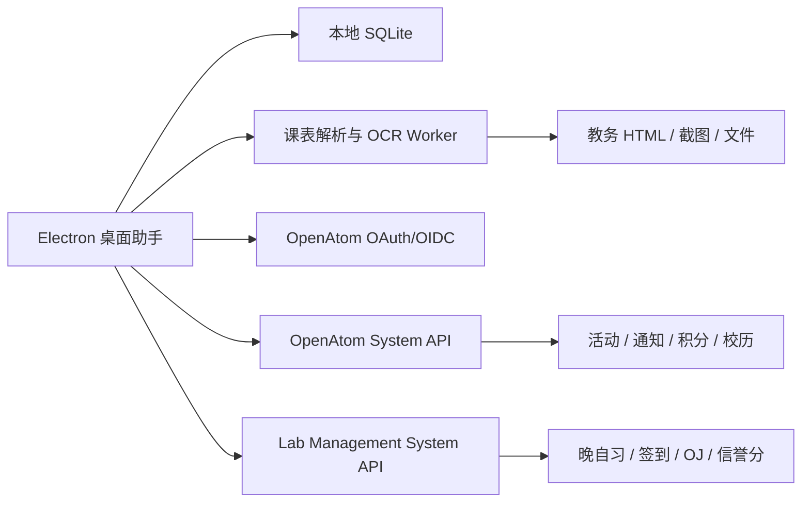

# OpenAtom 学习桌面助手 PRD

## 1. 文档信息

| 项目 | 内容 |
| --- | --- |
| 产品名称 | OpenAtom 学习桌面助手（暂定名） |
| 产品形态 | Windows / macOS 桌面应用，基于 Electron |
| 文档版本 | V1.0 |
| 输出日期 | 2026-07-14 |
| 文档状态 | 需求草案 |
| 关联项目 | OpenAtom System、Lab Management System |
| 首要用户 | 高校学生、OpenAtom 社团成员、实验室成员 |

## 2. 项目背景

学生的课程、作业、考试、个人计划和社团活动通常分散在教务平台、群聊、日历、待办应用及纸质笔记中，存在以下问题：

- 教务平台课表只能在线查看，操作路径长，且通常缺少桌面提醒。
- 不同学校、不同教务系统的数据结构不一致，课表难以统一导入。
- 课程安排与个人计划、社团活动、晚自习和刷题任务彼此割裂，容易发生时间冲突。
- 普通待办软件不理解“学期、教学周、单双周、节次、调休”等校园场景。
- 计划完成后缺少即时正反馈，用户难以长期坚持。
- OpenAtom System 已有活动、通知、积分、校历、签到等能力，Lab Management System 已有晚自习、每日一题、信誉分等能力，但缺少统一的学生桌面入口。

因此需要建设一款以课表为时间底座、以计划执行为核心、以激励反馈为驱动的桌面应用，并与现有 OpenAtom 平台形成互补。

## 3. 产品定位

### 3.1 一句话定位

一款能自动导入高校课表、统一安排课程与个人计划，并通过持续反馈帮助学生完成目标的桌面学习工作台。

### 3.2 产品原则

- **本地优先**：无网络时仍可查看课表、编辑计划和记录完成情况。
- **用户可控**：任何自动解析结果必须先预览确认，不能直接覆盖用户数据。
- **课表驱动**：计划推荐、冲突检测和提醒围绕教学周与课程时间展开。
- **低打扰**：通知可解释、可暂停、可按课程或计划单独配置。
- **正向激励**：鼓励稳定完成，不使用羞辱、强制排行或过度惩罚机制。
- **安全隔离**：教务平台凭证、网页会话、OCR 图片和应用数据按最小权限处理。
- **渐进接入**：个人学习功能可独立使用，登录 OpenAtom 后再启用社团与实验室能力。

### 3.3 产品边界

桌面助手不是新的教务系统，不修改学校教务数据；不是完整社团管理后台；不在首版提供在线监考、自动代签到、自动抢课或绕过验证码等能力。

## 4. 产品目标与成功指标

### 4.1 产品目标

1. 让用户在 5 分钟内完成一次课表导入或手动创建。
2. 将课程、考试、个人计划、社团活动和实验室安排统一展示在一个时间视图中。
3. 降低漏课、漏交作业和计划拖延的概率。
4. 通过积分、连续完成、等级与成就建立可持续的正向反馈。
5. 复用 OpenAtom 已有账号、活动、通知、积分、校历、签到和 OJ 能力，形成统一入口。

### 4.2 首版建议指标

| 指标 | 目标值 | 统计口径 |
| --- | --- | --- |
| 课表首次导入成功率 | ≥ 85% | 用户进入导入流程后，最终确认至少 1 门课程 |
| OCR 课程字段可用率 | ≥ 90% | 经用户确认无需修改的核心字段占比 |
| HTML 解析成功率 | 已适配平台 ≥ 95% | 成功生成可预览课程列表 |
| 首次导入耗时 | 中位数 ≤ 5 分钟 | 从进入导入页到确认完成 |
| 计划周完成率 | ≥ 60% | 到期计划中按时或宽限期内完成的比例 |
| 7 日留存 | ≥ 35% | 首次创建课表或计划后的第 7 日活跃 |
| 崩溃率 | < 0.5% | 有效会话中异常退出比例 |

指标只在用户同意匿名统计后采集，默认不上传课表正文、计划正文、教务页面内容或截图。

## 5. 用户角色与典型场景

### 5.1 普通学生

- 从教务平台导入本学期课表。
- 查看今日课程、空闲时间和下节课倒计时。
- 添加作业、考试复习、阅读、运动等计划。
- 接收上课、截止时间和冲突提醒。
- 查看本周学习投入与连续完成记录。

### 5.2 OpenAtom 社团成员

- 使用 OpenAtom 账号登录桌面助手。
- 查看已报名活动、社团通知、积分和校历。
- 将社团活动同步到个人日程。
- 从活动或通知快速创建个人准备任务。

### 5.3 实验室成员

- 查看晚自习安排、签到状态、每日一题和实验室通知。
- 将每日一题加入今日计划。
- 查看实验室信誉分及签到积分流水。

### 5.4 非登录用户

- 仅使用本地课表、计划、提醒和激励功能。
- 后续登录时选择是否合并本地数据，不强制上传。

## 6. 核心用户旅程

### 6.1 首次使用

1. 用户安装并启动应用。
2. 选择“本地使用”或“登录 OpenAtom”。
3. 设置学校、学期、开学日期、每节课时间；若 OpenAtom 校历已有配置，可一键采用。
4. 选择课表导入方式：教务网页、课表截图、文件/剪贴板、手动添加。
5. 系统解析并展示结果、置信度、冲突和缺失字段。
6. 用户修正后确认导入。
7. 系统进入“今日”工作台，引导创建第一个计划并配置提醒。

### 6.2 日常使用

1. 应用随系统启动后驻留托盘。
2. 用户在“今日”查看下一门课、今日计划、活动与晚自习。
3. 用户开始专注、完成计划或调整安排。
4. 系统发放本地成长值，更新连续完成与成就进度。
5. 日终生成轻量回顾，未完成计划由用户决定顺延、拆分或放弃。

### 6.3 学期切换

1. 系统根据校历提示新学期创建课表。
2. 旧课表只读归档，不直接删除。
3. 用户重新导入，系统识别同名课程并询问是否继承颜色、提醒和备注。

## 7. 功能架构与优先级

| 模块 | P0 首版 | P1 增强版 | P2 规划版 |
| --- | --- | --- | --- |
| 课表 | 手动添加、截图 OCR、HTML/剪贴板解析、周课表、冲突检测 | 平台适配器市场、iCalendar 导入导出、自动更新 | 多校区通勤建议、跨设备协作课表 |
| 计划 | 待办、子任务、重复计划、截止时间、课程关联 | 目标/项目、模板、时间块、复盘 | AI 拆解与排程建议 |
| 提醒 | 上课、任务、考试、勿扰、托盘 | 智能提醒、地理/网络条件提醒 | 多端联动 |
| 激励 | 成长值、等级、连续完成、徽章、周报 | 主题解锁、积分兑换、好友互助 | 社团挑战与赛季活动 |
| OpenAtom 接入 | 登录、通知、活动、积分、校历 | 报名、请假、知识库、博客 | 工作流待办、AI 活动协作 |
| LMS 接入 | 晚自习、签到状态、每日一题、信誉分 | OJ 提交状态、刷题统计 | 学习路径推荐 |
| 数据 | SQLite、本地备份、导出 | 端到端加密同步 | 多设备版本合并 |

## 8. 详细功能需求

## 8.1 账号、身份与数据模式

### 8.1.1 使用模式

- 支持“仅本地使用”，无需注册账号。
- 支持通过现有 OpenAtom OAuth/OIDC 登录。
- 登录后可启用 OpenAtom 与 LMS 数据卡片。
- 登录不代表自动上传本地课表和计划；首次同步必须明确征得用户同意。
- 退出登录时保留本地数据，并允许清除远端令牌与缓存。

### 8.1.2 数据合并

- 本地用户首次登录时可选择：保留本地、不上传；合并到账号；创建新的空白空间。
- 合并前展示数据数量和可能冲突。
- 同一记录使用稳定 UUID；同步冲突默认保留双方版本，由用户选择。

### 8.1.3 验收标准

- 无网络、未登录状态下可以完成课表、计划和提醒的核心操作。
- OpenAtom 登录令牌保存在系统安全凭据库，不以明文写入配置文件或日志。
- 用户可在设置中查看本地数据目录、导出全部数据并执行清除。

## 8.2 学期、校历与节次设置

### 8.2.1 学期设置

- 新建、编辑、归档学期。
- 字段包括学期名称、开学日期、结束日期、总周数、当前周、默认校区、时区。
- 支持 18/20 周等常见模板和自定义周数。
- 支持从 OpenAtom 公开校历读取开学日期、放假和调休信息。

### 8.2.2 节次设置

- 配置第 1-N 节课的开始与结束时间。
- 支持上午、下午、晚上分组以及大节/小节显示。
- 支持不同校区或特殊日期使用不同作息表。
- 调休时允许将某日按另一星期的课表执行。

### 8.2.3 规则

- 教学周以开学日期所在周为第 1 周，学校规则不同时允许手工修正。
- 所有课程实例均由“课程规则 + 学期 + 校历调整”计算生成，避免为每周重复存储完整数据。
- 修改开学日期、节次时间前展示受影响课程数量。

## 8.3 课表导入中心

课表导入统一经过“来源选择 → 采集 → 解析 → 规范化 → 校验 → 预览修正 → 确认写入”流程。任何来源都不能绕过预览确认。

### 8.3.1 教务网页 HTML 导入

#### 支持方式

1. **应用内网页登录**：在独立、受限的教务登录窗口中由用户自行登录，用户点击“读取当前课表”后提取当前页面 DOM 或网络响应。
2. **粘贴 HTML**：用户从浏览器“保存网页”或复制页面源代码后导入。
3. **粘贴表格/文本**：解析从网页复制出的表格文本。
4. **平台适配器**：针对已知教务平台，以版本化适配器将原始结构转换为统一课程模型。

#### 适配器要求

- 每个适配器声明平台标识、适用域名、版本、匹配规则和字段映射。
- 适配器只能访问明确允许的页面范围，不能获取无关成绩、个人资料或财务数据。
- 解析失败时保存脱敏后的结构诊断信息需用户单独授权。
- 适配器失效不影响手动、OCR 等其他导入方式。
- 支持适配器版本回滚和远程停用；适配器包必须签名校验。

#### 安全规则

- 禁止要求用户向应用提供教务账号密码；登录动作必须在教务平台页面完成。
- 默认不持久化教务会话；如用户选择“保持登录”，会话按学校域名隔离并可一键清除。
- 禁止注入绕过验证码、风控或学校访问控制的代码。
- 默认不后台轮询教务平台；自动更新必须由用户开启并配置频率。
- 教务平台不允许自动化访问时，应用应提示改用截图、文件或手动导入。

### 8.3.2 截图 OCR 导入

#### 输入

- 支持 PNG、JPG、JPEG、WebP 及系统剪贴板图片。
- 支持整张课表截图、分段截图和多张截图批量导入。
- 支持拖拽文件与系统截图快捷键后直接粘贴。

#### 处理流程

1. 本地执行方向校正、裁剪、去噪、对比度增强和表格线检测。
2. OCR 识别课程名称、教师、教室、星期、节次、周次等文本。
3. 根据表格坐标、表头和节次配置恢复课程所在时间格。
4. 通过规则识别“1-16 周”“单周”“双周”“3-5,8-12 周”等表达。
5. 低置信度字段高亮，要求用户逐项确认。

#### OCR 策略

- 优先提供本地 OCR，原图不离开设备。
- 若启用云端 OCR，上传前明确展示服务商、上传内容、用途和保留策略，并取得单次或持续授权。
- 云端处理完成后按服务能力立即删除临时图片，客户端不保留上传副本。
- OCR 引擎不可用时允许用户直接进入表格化手动校对。

### 8.3.3 文件与标准格式导入

- P0 支持 CSV/Excel 表格和剪贴板文本导入。
- P1 支持 iCalendar（`.ics`）导入及导出。
- 提供可下载的标准课表模板，字段至少包含：课程名、教师、地点、星期、开始节次、结束节次、周次、单双周、课程备注。
- 文件中存在无法识别的列时，允许用户手动映射列名。

### 8.3.4 手动添加

- 快速添加课程名称、星期、节次、周次即可保存。
- 展开后可填写课程代码、教师、教室、校区、学分、颜色、备注、提醒。
- 支持复制课程、批量设置周次、单双周和跨节课程。
- 支持在周课表空白位置双击或拖拽时间段创建课程。

### 8.3.5 统一解析结果

每条候选课程至少包含：

- 课程名称。
- 星期。
- 开始/结束节次或明确的开始/结束时间。
- 有效周次集合。
- 来源类型与来源标识。
- 字段级置信度。

可选字段包括课程代码、教师、地点、校区、学分、分组、备注、课程链接。

### 8.3.6 校验与去重

- 检查课程名称、星期、节次和周次是否完整。
- 检查节次范围、周次范围是否超出当前学期。
- 检查同一周、同一时间段是否存在冲突。
- 对“同名 + 同教师 + 时间重合”课程给出去重建议。
- 对原课表更新采用差异预览，明确标记新增、修改、删除和未变化项。
- 确认导入时支持“合并”“替换当前学期”“另存为新课表”；替换前自动创建快照。

### 8.3.7 导入验收标准

- 用户可在确认前编辑所有解析字段。
- 解析失败时展示可理解原因和可继续操作的备选入口。
- 导入过程中关闭窗口或崩溃后，可恢复最近一次未确认草稿。
- 替换导入后可在 7 天内一键撤销到导入前快照。

## 8.4 课表与日程展示

### 8.4.1 主要视图

- **今日视图**：下节课、课程倒计时、今日计划、活动、晚自习、截止事项。
- **周课表**：按星期和节次展示，支持切换教学周。
- **日历视图**：月/周/日视图统一展示课程、考试、计划和活动。
- **列表视图**：按课程或时间查看，便于搜索和批量编辑。

### 8.4.2 交互

- 课程按自定义颜色显示；不同来源通过图标区分。
- 点击课程展示教师、地点、周次、备注、相关任务和课程资料入口。
- 支持拖动临时调整单次课程；需选择“仅本次”或“整个重复规则”。
- 支持隐藏周末、显示周数、切换紧凑模式。
- 课程与计划重叠时显示冲突标识和可调整建议。

### 8.4.3 桌面能力

- 托盘菜单展示下一门课和最近计划。
- 可选开机启动、关闭时最小化到托盘。
- P1 提供桌面小组件/悬浮窗：下节课、今日完成度、专注计时。
- 支持全局快捷键快速添加计划；快捷键可修改或关闭。

## 8.5 计划与任务管理

### 8.5.1 任务模型

- 标题、描述、状态、优先级、预计时长、截止时间。
- 所属清单/项目、标签、关联课程、关联活动。
- 子任务、附件或本地文件链接。
- 重复规则、提醒规则、创建来源。
- 实际开始、完成时间和实际投入时长。

### 8.5.2 基础能力

- 快速添加今日任务。
- 查看收集箱、今天、即将到来、已完成和已逾期。
- 支持拖拽排序、批量完成、顺延、归档和恢复。
- 支持自然语言辅助录入，例如“周五 20 点交高数作业”；解析后必须让用户确认。
- 支持按课程自动建立任务清单。
- 支持将一次任务拆分为多个子任务。
- 重复计划支持按天、工作日、周、教学周或自定义周期。

### 8.5.3 课程相关计划

- 作业：支持截止时间、提交方式和完成状态。
- 复习：支持关联考试、复习范围和多阶段计划。
- 考试：记录时间、地点、科目、座位、材料要求。
- 课程资料：P1 支持为课程关联本地文件夹、网址和知识库条目。

### 8.5.4 时间规划

- 在日历中将任务拖入空闲时段形成时间块。
- 创建计划时检测与课程、活动、晚自习的冲突。
- 系统可按预计时长展示当天剩余可安排时间，但 P0 不自动改动用户计划。
- P1 提供“帮我安排”规则排程，生成方案后由用户确认。

### 8.5.5 日回顾与周回顾

- 日回顾展示完成、未完成、专注时长与明日事项。
- 未完成任务可选择顺延、拆分、重新排期或放弃，并可选填原因。
- 周回顾展示课程出勤自记、任务完成率、连续完成、投入分布和下周重点。
- 回顾数据默认仅保存在本地。

## 8.6 专注功能

- 支持正计时和番茄钟，默认 25/5 分钟，可自定义。
- 开始专注时选择关联任务或课程。
- 暂停、继续、提前结束时记录真实时长。
- 系统休眠、关机或应用异常退出后能恢复计时状态。
- 可开启专注期间静默应用内非紧急通知。
- P1 支持网站/应用分心提醒，但不得擅自强制关闭其他应用。

## 8.7 提醒与通知

### 8.7.1 提醒类型

- 上课前提醒、下课提醒、地点变更提醒。
- 任务开始、截止前、逾期提醒。
- 考试多阶段提醒。
- 社团活动、晚自习和签到提醒。
- 每日计划和日终回顾提醒。

### 8.7.2 提醒动作

- 完成任务、稍后提醒、打开详情、开始专注。
- 课程提醒可快速复制教室、打开地图或课程链接。
- 提醒动作必须在离线状态下可执行并在恢复联网后同步。

### 8.7.3 降噪规则

- 支持全局勿扰时段、临时暂停和会议/专注模式。
- 同一事项的提醒自动合并，避免多渠道重复弹出。
- 已在其他来源取消的活动不再提醒。
- 关键提醒与普通提醒可分别设置。

## 8.8 激励与成长系统

### 8.8.1 核心概念

- **成长值 XP**：反映个人学习行为，只用于本地等级与外观解锁。
- **连续完成**：按用户设定的“最低有效日目标”计算，不要求每天满负荷。
- **徽章**：用于记录里程碑，如首次导入、连续 7 天、完成 50 个任务。
- **OpenAtom 积分**：现有平台的正式积分账户，与本地成长值分开显示和结算。
- **实验室信誉分**：LMS 的独立规则数据，不与成长值互相兑换。

### 8.8.2 建议计分规则

| 行为 | 成长值建议 | 限制 |
| --- | ---: | --- |
| 完成普通任务 | +5 | 每日计分上限 20 个 |
| 按时完成高优先级任务 | +8 | 创建后立即完成不计额外奖励 |
| 完成一次有效专注 | 每 25 分钟 +3 | 每日最多 12 次 |
| 完成日回顾 | +3 | 每日一次 |
| 完成周回顾 | +10 | 每周一次 |
| 连续完成里程碑 | +10～100 | 里程碑一次性奖励 |
| 逾期或放弃任务 | 0 | 不扣成长值，不破坏历史等级 |

### 8.8.3 防刷与公平性

- 任务至少存在 2 分钟或产生有效专注记录后，才可获得完整奖励。
- 重复创建/删除、批量瞬时完成只记有限成长值。
- 修改系统时间不应重复领取同一周期奖励。
- 本地成长值可离线计算；若未来参与线上挑战，服务端重新校验合格事件。

### 8.8.4 正向反馈

- 完成任务后提供轻量动画、音效和成长进度，均可关闭。
- 连续记录允许每月有限次数“保护日”，避免一次中断导致完全归零。
- 不公开展示低完成率，不向其他用户推送失败信息。
- 周报强调趋势和可改进建议，不使用负面人格评价。

### 8.8.5 与现有积分系统的关系

- OpenAtom 积分、兑换物品、兑换记录和排行榜继续由现有后端维护。
- 桌面助手只展示并调用已授权接口，不自行伪造正式积分交易。
- P1 可将符合规则的社团任务完成事件提交后端审核，审核通过后发放 OpenAtom 积分。

## 8.9 OpenAtom System 功能接入

### 8.9.1 P0 接入

- **统一登录**：复用 OAuth/OIDC，不在桌面端保存账号密码。
- **通知中心**：展示站内通知、未读数和跳转入口。
- **活动**：展示活动列表、详情、本人已报名活动，并可加入个人日程。
- **积分**：展示积分余额、流水、兑换物品和兑换记录。
- **校历**：读取学期、节假日和调休信息，辅助课表计算。
- **个人资料**：展示基础身份与社团成员状态。

### 8.9.2 P1 接入

- 在桌面端报名活动、取消报名并接收状态通知。
- 查看和提交请假申请，将请假状态同步到日程。
- 查看规章、博客、获奖记录和招新进度。
- 从通知或活动一键创建计划。
- 接入知识库后，将制度、课程资料或 FAQ 关联到计划。

### 8.9.3 不纳入个人桌面端的能力

- 用户、角色、权限、社团、部门、岗位等完整管理后台。
- 招新批次、面试、积分人工调整、日志审计等管理员功能。
- 如未来有桌面管理需求，应以独立“管理模式”评审，不与学生首版混合。

## 8.10 Lab Management System 功能接入

- 展示今日晚自习场次、时间、状态和签到结果。
- 展示实验室信誉分、累计签到、签到积分流水。
- 展示每日一题，可一键加入今日计划并打开题面。
- 展示实验室通知。
- P1 展示 OJ 提交状态、AC 记录和刷题统计。
- 不提供代签到、模拟定位或自动提交答案能力。

## 8.11 搜索、快捷操作与命令中心

- 全局搜索课程、计划、活动、通知和课程资料。
- 命令中心支持快速添加任务、打开今天、开始专注、切换周次等动作。
- 支持用户自定义全局快捷键，检测与系统快捷键冲突。
- 搜索索引默认在本地建立，退出登录后移除远端内容缓存。

## 8.12 数据导入、导出与备份

- 导出全部个人数据为 JSON 备份包。
- 导出课表为 CSV；P1 支持 `.ics`。
- 自动备份频率可配置，默认每日保留最近 7 个、每周保留最近 4 个。
- 备份恢复前展示覆盖范围并自动创建当前快照。
- 备份包可选密码加密。
- 用户删除数据时区分“仅本机删除”和“本机及云端删除”。

## 8.13 设置与可访问性

- 浅色、深色、跟随系统主题。
- 中文为首发语言，预留国际化结构。
- 支持字号缩放、键盘操作、清晰焦点态和屏幕阅读器标签。
- 颜色不作为状态的唯一表达方式。
- 支持减少动画，尊重系统 `prefers-reduced-motion` 设置。
- 可单独关闭音效、动画、通知、开机启动和匿名统计。

## 9. 关键业务规则

### 9.1 周次表达

- 内部统一保存为有效周次集合或可等价计算的规则。
- 支持连续周、离散周、单双周和多个区间组合。
- 导入显示原始文本，便于用户对照。

### 9.2 冲突定义

- 同一日期时间范围有两个不可并行事件时为“硬冲突”。
- 截止时间接近、通勤时间不足或预计任务时长无法容纳时为“软冲突”。
- 系统只给出建议，不擅自删除或移动课程。

### 9.3 删除与归档

- 课程、计划先进入回收站，默认保留 30 天。
- 学期结束后课表归档并保持可检索。
- 已用于统计的任务删除后保留匿名汇总，用户执行彻底删除时同步移除。

### 9.4 时间与时区

- 数据库存储绝对时间使用 UTC，同时保存用户时区。
- 课程规则按学期所在时区计算。
- 用户跨时区时，不自动改变学校课程的本地时间，需明确提示。

## 10. 信息架构

主导航建议：

1. **今天**：下一课程、计划、活动、晚自习、专注入口。
2. **课表**：周课表、学期切换、导入与课程管理。
3. **计划**：收集箱、今天、即将到来、项目与回顾。
4. **日历**：课程、计划、考试、活动的统一时间视图。
5. **成长**：成长值、连续完成、成就、统计与 OpenAtom 积分。
6. **OpenAtom**：活动、通知、积分、实验室和知识内容。
7. **设置**：账号、学期、提醒、外观、数据、安全和关于。

当用户未登录 OpenAtom 时，第 6 项显示为可选接入入口，不影响本地功能。

## 11. 数据模型建议

### 11.1 核心实体

| 实体 | 关键字段 |
| --- | --- |
| `semester` | id、name、startDate、endDate、weekCount、timezone、status |
| `period_setting` | id、semesterId、campus、periodNo、startTime、endTime |
| `course` | id、semesterId、name、code、teacher、location、campus、color、sourceId |
| `course_schedule_rule` | id、courseId、weekday、startPeriod、endPeriod、startTime、endTime、weeks |
| `course_exception` | id、courseId、date、type、newTime、newLocation、reason |
| `import_job` | id、type、source、status、parserVersion、createdAt、confirmedAt |
| `import_candidate` | id、jobId、rawText、normalizedData、confidence、validationStatus |
| `task` | id、title、status、priority、dueAt、estimateMinutes、courseId、projectId、source |
| `task_recurrence` | id、taskId、rule、timezone、nextOccurrenceAt |
| `focus_session` | id、taskId、startedAt、endedAt、duration、status |
| `reminder` | id、entityType、entityId、triggerAt、channel、status |
| `growth_event` | id、eventType、entityId、xp、occurredAt、idempotencyKey |
| `achievement` | id、code、name、rule、status |
| `sync_mapping` | id、localEntityId、remoteSystem、remoteEntityId、version、syncStatus |

### 11.2 数据约束

- 所有本地业务实体使用 UUID，避免离线创建后的主键冲突。
- `growth_event.idempotencyKey` 唯一，防止重复计分。
- 导入候选数据与正式课程分表保存，未确认数据不得进入正式课表。
- 教务网页 Cookie、OAuth Token 等敏感数据不写入业务数据库。

## 12. 技术架构建议

### 12.1 客户端架构

- Electron 主进程：窗口、托盘、通知、更新、协议、文件系统和安全凭据。
- Preload：通过白名单 IPC 暴露最小能力。
- Renderer：建议复用项目 Vue 3、Vite、TypeScript 技术栈。
- 本地数据：SQLite；通过 Repository 层隔离具体驱动。
- 后台任务：提醒调度、备份、同步、OCR 与解析放入 Worker 或 Utility Process，避免阻塞 UI。
- 解析器：采用统一接口和平台适配器机制，原始输入转换为标准候选课程模型。

### 12.2 与现有系统关系

### 12.3 同步策略

- P0 个人课表和计划仅保存在本地，平台数据按需读取并缓存。
- 远端数据使用 `ETag`、版本号或更新时间做增量刷新。
- 本地操作队列在恢复网络后重试，所有写操作带幂等键。
- P1 若启用云同步，采用字段级版本或保留冲突副本，不静默覆盖。

### 12.4 自动更新

- 安装包和更新包必须签名。
- 支持稳定版通道；P1 可增加测试版通道。
- 更新下载失败不影响离线使用。
- 数据库迁移前自动备份，迁移失败回滚应用状态并提示用户。

## 13. Electron 安全要求

- `contextIsolation: true`。
- `nodeIntegration: false`。
- Renderer 不直接访问 Node.js、文件系统、Shell 或系统凭据。
- IPC 使用固定通道、参数校验和返回值校验，禁止通用命令执行接口。
- 教务平台使用独立 Session Partition，与主应用登录态隔离。
- 对应用内网页配置严格导航白名单，外部链接交由系统浏览器打开。
- 禁止任意新窗口、任意下载和不受控的权限申请。
- 配置严格 CSP，禁止加载未授权脚本。
- OAuth 使用 Authorization Code + PKCE，并校验 `state`、回调协议和来源。
- Token、可持久化 Cookie 和备份密码使用系统 Keychain/Credential Vault。
- 日志自动脱敏 Token、Cookie、学号、手机号、课表正文和计划正文。
- OCR 图片和 HTML 原文默认在解析完成或导入取消后删除；诊断留存需单独授权。
- 依赖定期进行漏洞扫描，高危漏洞发布前必须处理或给出风险豁免记录。

## 14. 隐私与合规要求

- 首次使用提供简明隐私说明，分别解释本地数据、OpenAtom 数据和教务数据的用途。
- 数据采集遵循最小必要原则；导课不应读取成绩、缴费、身份证等无关信息。
- 云 OCR、云同步和匿名统计分别授权，不能捆绑同意。
- 用户可查看已授权的学校域名、远端服务和数据范围，并随时撤销。
- 支持导出个人数据和彻底删除数据。
- 教务适配需遵守学校平台用户协议、访问频率和自动化限制。
- 面向未成年人或扩展到更多学校时，需在上线前完成针对性合规评估。

## 15. 非功能需求

### 15.1 性能

- 冷启动目标 ≤ 3 秒，普通设备 P95 ≤ 5 秒。
- 今日页本地数据首屏渲染 ≤ 1 秒。
- 100 门课程、5000 条任务下常用查询 P95 ≤ 300ms。
- OCR、同步和备份不得长时间阻塞渲染线程。
- 常驻托盘空闲内存建议控制在 250MB 内，CPU 平均占用接近 0%。

### 15.2 可用性与可靠性

- 核心本地功能月可用性目标 ≥ 99.9%。
- 应用异常退出后不损坏 SQLite 数据，使用事务与 WAL。
- 关键写入后及时落盘，导入和批量变更具备事务性。
- 提醒调度在系统休眠恢复后补算，过时提醒按规则合并而非集中轰炸。

### 15.3 兼容性

- 首版建议支持 Windows 10/11 x64、macOS 13+ Apple Silicon/x64。
- Linux 可作为 P1 评估项。
- 不同系统的通知、开机启动、凭据库和签名流程分别验收。

### 15.4 可观测性

- 记录应用版本、崩溃堆栈、解析器版本和错误码，不记录用户正文。
- 解析失败提供本地诊断报告预览，用户确认后才可上传。
- 关键链路定义统一错误码：导入、OCR、登录、同步、提醒和更新。

## 16. 埋点建议

在用户同意匿名统计的前提下采集：

- 首次启动、完成引导、选择使用模式。
- 选择导入方式、解析成功/失败、确认导入、导入课程数量。
- 创建/完成/顺延计划的计数，不采集标题和描述。
- 开始/完成专注的时长区间。
- 提醒送达与动作类型。
- OpenAtom/LMS 功能启用率。
- 崩溃、更新结果和性能区间。

禁止采集教务账号密码、Cookie、Token、截图、HTML 正文、课程名、教师、教室、计划正文和附件内容。

## 17. MVP 范围

### 17.1 必须完成

- Electron + Vue 3 基础应用、托盘、系统通知、自动备份。
- 本地模式和 OpenAtom OAuth/OIDC 登录。
- 学期、周次、节次和校历设置。
- 手动添加课程。
- 截图 OCR 导入及校对。
- 至少 1 个目标教务平台 HTML 适配器，以及粘贴 HTML/表格的通用入口。
- 导入预览、字段置信度、校验、去重、冲突检测和撤销。
- 今日、周课表、基础日历视图。
- 任务、子任务、重复、截止时间、课程关联和提醒。
- 基础专注计时。
- 成长值、等级、连续完成和首批徽章。
- OpenAtom 通知、活动、积分、校历读取。
- LMS 晚自习、签到状态、每日一题、信誉分读取。
- JSON 备份恢复、CSV 导出、隐私设置和日志脱敏。

### 17.2 首版不做

- 未经适配的所有高校教务平台自动解析承诺。
- 后台自动登录、自动抢课、自动评教、自动签到。
- 多人共享课表和社交排行榜。
- 个人计划的默认云同步。
- AI 自动修改用户日程。
- 将本地成长值直接兑换为 OpenAtom 正式积分。

## 18. 版本规划

### 18.1 Phase 0：验证期（2～3 周）

- 访谈 8～12 名学生，收集真实课表样本并完成脱敏。
- 确定首个目标教务平台和支持边界。
- 验证 HTML、截图 OCR、周次解析和表格坐标恢复方案。
- 完成 Electron 安全基线、数据模型和低保真原型。

### 18.2 Phase 1：MVP（8～12 周）

- 完成本地课表、计划、提醒、专注和成长系统。
- 完成导入预览、差异更新、快照与恢复。
- 接入 OpenAtom 与 LMS 的 P0 只读能力。
- 完成 Windows/macOS 安装、签名、更新与基础埋点。

### 18.3 Phase 2：增强版（6～8 周）

- 扩展教务适配器、iCalendar、课程资料和时间块。
- 增加计划模板、自动排程建议、周报和外观解锁。
- 支持活动报名、请假、OJ 统计和知识库。
- 评估端到端加密云同步。

### 18.4 Phase 3：生态版

- 发布签名适配器规范与审核机制。
- 支持更多高校、更多平台和多设备体验。
- 推出社团挑战、学习路径和经用户确认的 AI 计划助手。

## 19. 上线验收清单

### 19.1 功能验收

- 四种导入路径均可完成或提供明确降级方案。
- 单双周、多区间周次、跨节课程和调休场景计算正确。
- 导入替换、崩溃恢复、撤销与备份恢复可用。
- 离线状态可查看课表、编辑计划、完成任务和触发本地提醒。
- OpenAtom/LMS 服务不可用时不阻塞本地工作台。
- 成长值事件幂等，修改系统时间不能重复领取周期奖励。

### 19.2 安全验收

- 完成 Electron 安全配置检查和 IPC 白名单审计。
- 验证 Renderer 无法直接访问 Node.js 和系统凭据。
- 验证 OAuth PKCE、回调校验、Token 安全存储和退出清理。
- 验证教务 Session 分区、导航白名单、权限拦截和数据删除。
- 日志、崩溃报告和诊断包不包含敏感正文。

### 19.3 体验验收

- 新用户不看说明也能在 5 分钟内完成一次课表导入。
- 所有低置信度字段有明显但不干扰的提示。
- 键盘可完成核心操作，缩放至 200% 时页面仍可使用。
- 减少动画、勿扰、通知和匿名统计开关生效。

## 20. 风险与应对

| 风险 | 影响 | 应对策略 |
| --- | --- | --- |
| 教务页面频繁改版 | HTML 解析失效 | 适配器版本化、健康检查、快速停用、OCR/手动降级 |
| 学校禁止自动化访问 | 合规风险 | 不绕过限制，改用用户主动导出的 HTML、截图或文件 |
| OCR 表格结构复杂 | 导入错误 | 坐标与文本联合解析、字段置信度、强制预览校对 |
| Electron 攻击面较大 | 凭据或本地数据泄露 | 进程隔离、最小 IPC、导航白名单、签名更新、安全审计 |
| 提醒过多 | 用户卸载 | 通知合并、默认克制、勿扰与细粒度设置 |
| 激励系统被刷 | 数据失真 | 事件幂等、每日上限、线上挑战服务端校验 |
| 功能范围过大 | MVP 延期 | 坚持 P0，本地学习闭环优先，平台管理能力不搬迁 |
| 云同步产生覆盖 | 数据丢失 | P0 不做个人数据云同步；P1 使用快照、版本和冲突副本 |

## 21. 待确认问题

以下问题需要在进入交互设计和技术排期前确认：

1. MVP 首个适配的学校及教务平台名称、登录方式和真实课表样本。
2. 首版是否必须同时发布 Windows 与 macOS，还是优先 Windows。
3. OCR 是否必须完全离线，还是允许用户自选云端 OCR。
4. 个人课表和计划首版是否需要跨设备同步。
5. OpenAtom 活动报名、积分兑换在首版做只读还是允许写操作。
6. 产品正式名称、品牌视觉和是否沿用 OpenAtom 账号体系作为默认登录。
7. 是否需要面向非 OpenAtom 用户公开发行，以及对应隐私政策和运营主体。

## 22. 推荐的下一步产物

1. 教务平台调研与适配器技术方案。
2. 产品信息架构与核心页面线框图。
3. SQLite 数据库设计及迁移方案。
4. Electron 安全基线与 IPC 接口清单。
5. OpenAtom/LMS 桌面端 API 契约。
6. MVP 研发任务拆分、依赖关系和里程碑排期。

